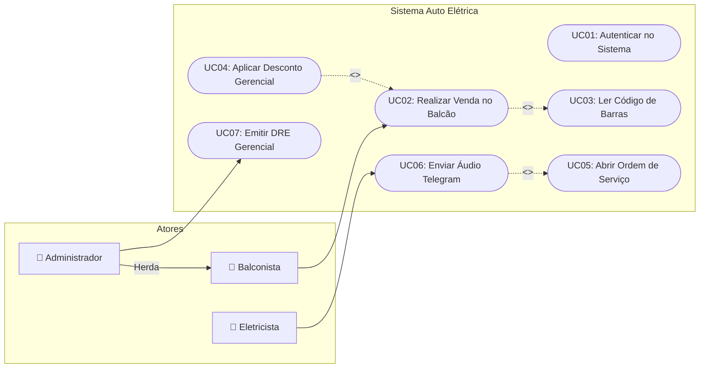
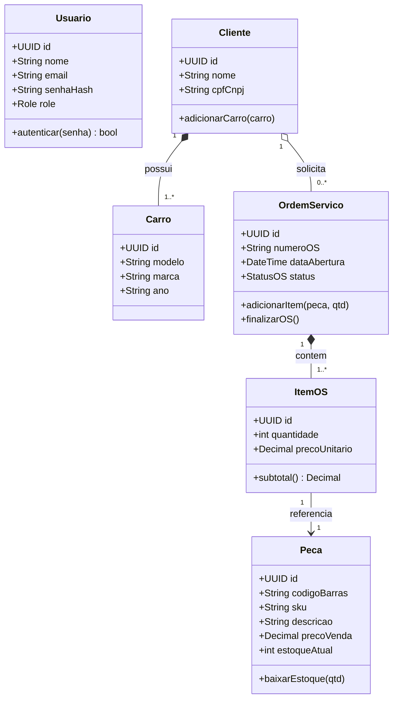
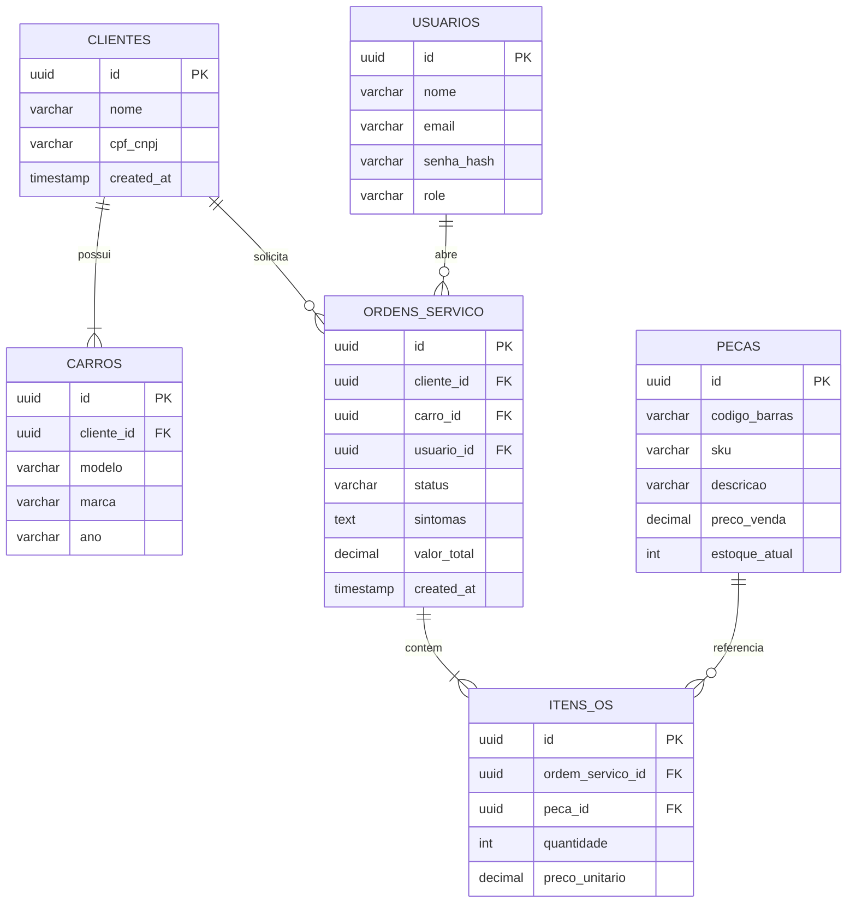
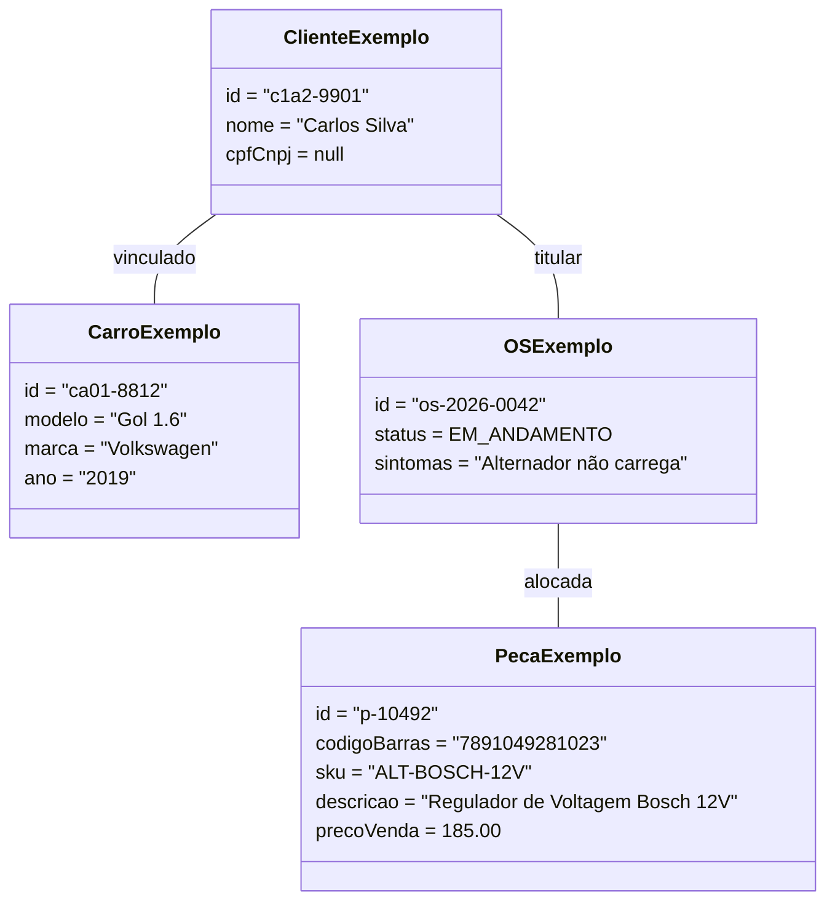
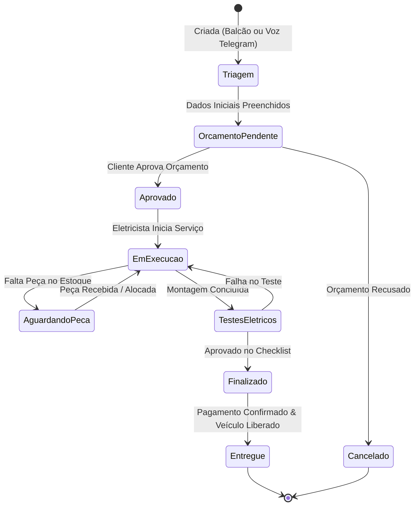
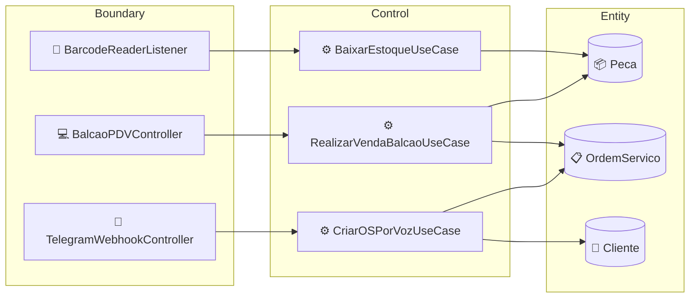
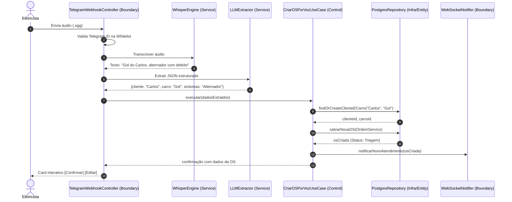
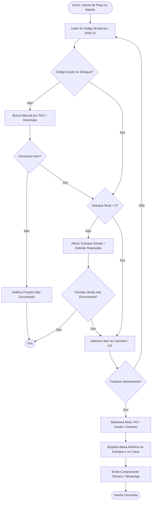
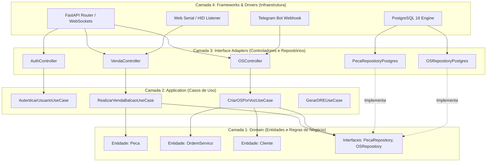

# Documento de Software (Análise e Projeto)

Guia para produção de documento de software completo. Sempre seguir a ordem abaixo — cada seção alimenta a próxima (requisito → ator/caso de uso → classe → diagrama de atividade).

> **Atenção**: Perguntar ao usuário o domínio do sistema (o que o software faz) antes de começar, se ainda não souber. Sem domínio claro, não inventar requisitos genéricos demais — pedir contexto mínimo (usuários, principais funcionalidades, restrições).

Entregar o documento final como arquivo Markdown no repositório (ex: `docs/documento-software.md`) ou artifact, conforme pedido do usuário. Diagramas em Mermaid (renderizam nativo em artifacts e no GitHub).

---

## 1. Levantamento de Requisitos

Tabela de requisitos funcionais (RF) e não funcionais (RNF), numerados e rastreáveis.

* **Requisito Funcional (RF)**: comportamento/função que o sistema deve executar. Formato: `RFxx` — *Verbo + objeto + condição*.
* **Requisito Não Funcional (RNF)**: qualidade, restrição, atributo (desempenho, segurança, usabilidade, disponibilidade, portabilidade, escalabilidade, conformidade legal). Formato: `RNFxx` — *categoria: descrição + critério mensurável*.

### Template de Requisitos:

| ID | Descrição | Prioridade | Ator / Origem |
| :--- | :--- | :--- | :--- |
| **RF01** | O sistema deve permitir que o Balconista registre vendas via leitor de código de barras | Alta | Balconista |
| **RF02** | O sistema deve permitir que o Mecânico crie OS via comando de voz no Telegram | Alta | Mecânico |
| **RNF01** | O tempo de resposta na leitura do código de barras e baixa deve ser < 200ms | Alta | Desempenho |
| **RNF02** | Todas as operações de cancelamento e desconto devem gerar logs imutáveis | Alta | Segurança / Auditoria |

* **Categorias RNF comuns**: Desempenho, Segurança, Usabilidade, Confiabilidade, Manutenibilidade, Portabilidade, Escalabilidade, Compliance/Legal.
* *Rastreabilidade*: Cada RF vira candidato a caso de uso na Seção 2. Cada RNF vira restrição de arquitetura/design.

---

## 2. Diagrama de Casos de Uso

### Elementos Obrigatórios:
* **Atores**: Papéis externos (pessoa, sistema externo, tempo/cron). Ator primário inicia caso de uso; secundário participa.
* **Herança de Ator**: Ator especializado herda casos de uso do ator geral (ex: `Administrador --|> Usuario`).
* **`<<include>>`**: Comportamento obrigatório, sempre executado, fatorado de múltiplos casos de uso (seta tracejada, caso-base → caso incluído).
* **`<<extend>>`**: Comportamento opcional/condicional, insere-se em ponto de extensão do caso base (seta tracejada, caso-extensão → caso-base).

### Representação em Mermaid:



### Descrição Textual de Casos de Uso:
Para cada caso de uso relevante:
* **Ator Principal**: Quem dispara.
* **Pré-condições**: Estado necessário antes da execução.
* **Fluxo Principal**: Passo a passo do caminho feliz.
* **Fluxos Alternativos / Exceções**: Tratamento de desvios e erros.
* **Pós-condições**: Estado garantido após a execução.

---

## 3. Diagrama de Classes

Extrair classes candidatas dos substantivos dos casos de uso e requisitos. Definir atributos, métodos, visibilidade (`+` public, `-` private, `#` protected) e multiplicidade.

### Relações a Diferenciar:
* **Herança / Generalização**: `ClasseFilha --|> ClasseMae` ("É um").
* **Composição**: Parte não existe sem o todo (`*--`). Ciclo de vida dependente.
* **Agregação**: Parte pode existir independente do todo (`o--`). Vínculo fraco.
* **Associação Simples**: Relação de uso com multiplicidade.

### Representação em Mermaid:



### Tabela de Persistência:

| Classe | Persistente? | Estratégia | Observação |
| :--- | :---: | :--- | :--- |
| **Usuario** | Sim | Tabela `usuarios`, PK `id` | Criptografia Bcrypt na senha |
| **Cliente** | Sim | Tabela `clientes`, PK `id` | CPF/CNPJ opcional |
| **Carro** | Sim | Tabela `carros`, FK `cliente_id` | Composição com Cliente |
| **OrdemServico** | Sim | Tabela `ordens_servico`, PK `id` | Ciclo de vida controlado por State Machine |
| **ItemOS** | Sim | Tabela `itens_os`, FK `ordem_servico_id` | Composição com OrdemServico |
| **Peca** | Sim | Tabela `pecas`, PK `id` | Índices B-Tree em `codigo_barras` e `sku` |
| **StatusOS** | Não (Enum) | Coluna `status` (VARCHAR/ENUM) | Valor embutido |

---

## 3.1. Diagrama Entidade-Relacionamento (DER)

Derivado diretamente da tabela de persistência. Mostra chaves primárias (PK), chaves estrangeiras (FK) e tipos relacionais.



---

## 4. Diagrama de Objetos

Instantâneo (*snapshot*) de tempo de execução exemplificando instâncias reais, valores e relacionamentos:



---

## 5. Diagrama de Estados (Ciclo de Vida Complexo)

Obrigatório para entidades com máquina de estados finitos e regras de transição.

### Ciclo de Vida da Ordem de Serviço (`OrdemServico`):



---

## 6. Classes de Fronteira, Controle e Entidade (BCE)

Separação conceitual precursora da Clean Architecture:
* **Boundary (Fronteira)**: Telas, interfaces REST, listeners de leitor, webhooks do Telegram (`XxxController`, `XxxView`, `XxxWebhook`).
* **Control (Controle)**: Casos de uso e orquestração de regras (`XxxUseCase`, `XxxService`).
* **Entity (Entidade)**: Modelos puros de domínio persistentes (`Cliente`, `Peca`, `OrdemServico`).



---

## 7. Diagrama de Sequência

Detalha a ordem temporal de mensagens, validações, chamadas assíncronas e retornos.

### Caso de Uso: Abertura de OS via Telegram Voice Bot



---

## 8. Diagrama de Atividades

Mapeia o fluxo de processo de negócio com bifurcações, validações e decisões.



---

## 9. Diagrama de Componentes (Clean Architecture)

Estruturação das camadas respeitando a Regra de Dependência (camadas externas dependem das internas).



---

## 10. Implementação: DDD, Clean Architecture e TDD

### 10.1. Domain-Driven Design (DDD)
* **Aggregate Root**: `OrdemServico` (gerencia seus `ItensOS`), `Cliente` (gerencia seus `Carros`).
* **Value Objects**: `Dinheiro`, `CPF_CNPJ`, `CodigoBarras`, `PeriodoDRE`.
* **Domain Services**: `CalculadoraMargemLucroService`, `ConciliadorCaixaService`.
* **Repository Interfaces**: Declaradas no domínio (`peca_repository.py`), implementadas na infraestrutura.

### 10.2. Estrutura de Diretórios Padronizada
```
src/
├── domain/                  # Camada mais interna (Zero dependências externas)
│   ├── entities/            # Peca, OrdemServico, Cliente, Usuario
│   ├── value_objects/       # Dinheiro, CodigoBarras
│   └── repositories/        # Interfaces abstratas de persistência
├── application/             # Casos de uso e orquestração
│   ├── use_cases/           # RealizarVendaUseCase, CriarOSPorVozUseCase
│   └── dtos/                # Schemas de entrada e saída (Pydantic DTOs)
├── adapters/                # Controladores, gateways e adaptadores
│   ├── controllers/         # Endpoints FastAPI, Handlers Telegram
│   └── repositories/        # Implementações SQLAlchemy / Postgres
└── infra/                   # Configurações de banco, drivers e integrações
    ├── database/            # Conexão assíncrona Postgres
    └── integrations/        # Whisper Engine, Telegram Bot API
```

### 10.3. Test-Driven Development (TDD)
* **Ciclo Red → Green → Refactor**:
  1. **Teste de Domínio**: Testar regras de negócio puras (ex: cálculo de desconto, transição de estado da OS) sem instanciar banco de dados.
  2. **Teste de Caso de Uso**: Testar fluxos de aplicação usando repositórios em memória (*Fake Repository*).
  3. **Teste de Integração**: Testar endpoints HTTP e consultas reais do PostgreSQL.
* **Rastreabilidade Obrigatória**: Cada Requisito Funcional (`RFxx`) deve possuir ao menos uma suíte de testes unitários ou de integração vinculada.

---

## Checklist Final de Qualidade

- [x] Requisitos Funcionais e Não Funcionais tabulados e mensuráveis.
- [x] Diagrama de Casos de Uso com herança de atores e include/extend.
- [x] Diagrama de Classes com multiplicidades, composição, agregação e tabela de persistência.
- [x] Diagrama Entidade-Relacionamento (DER) rigoroso.
- [x] Diagrama de Objetos exemplificando cenário concreto.
- [x] Diagrama de Estados para ciclo de vida de OS.
- [x] Classes Boundary-Control-Entity (BCE) mapeadas por caso de uso.
- [x] Diagrama de Sequência detalhando fluxo síncrono/assíncrono.
- [x] Diagrama de Atividades com forks, joins e decisões de balcão.
- [x] Diagrama de Componentes alinhado à Clean Architecture.
- [x] Mapeamento DDD, diretórios e plano de testes TDD.
