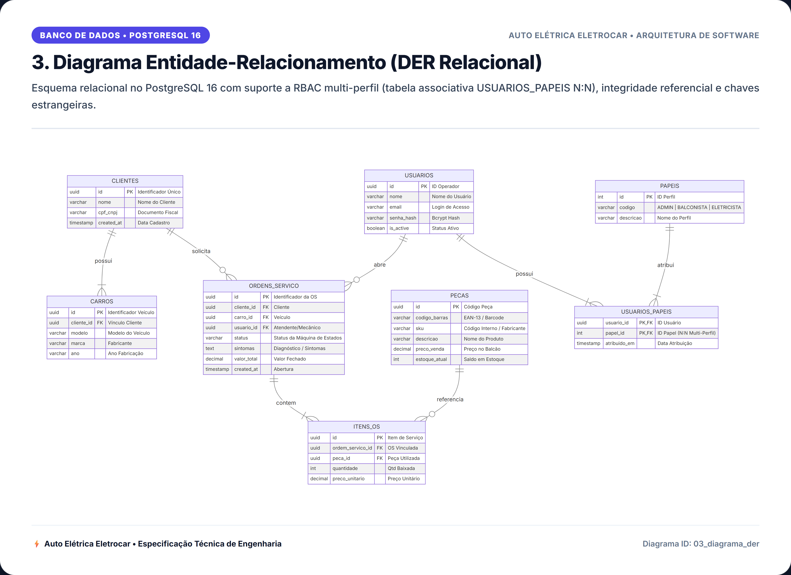
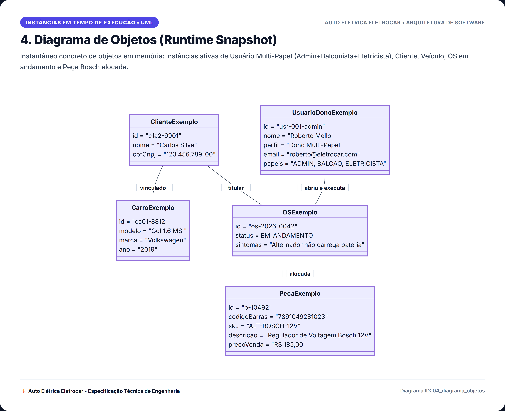
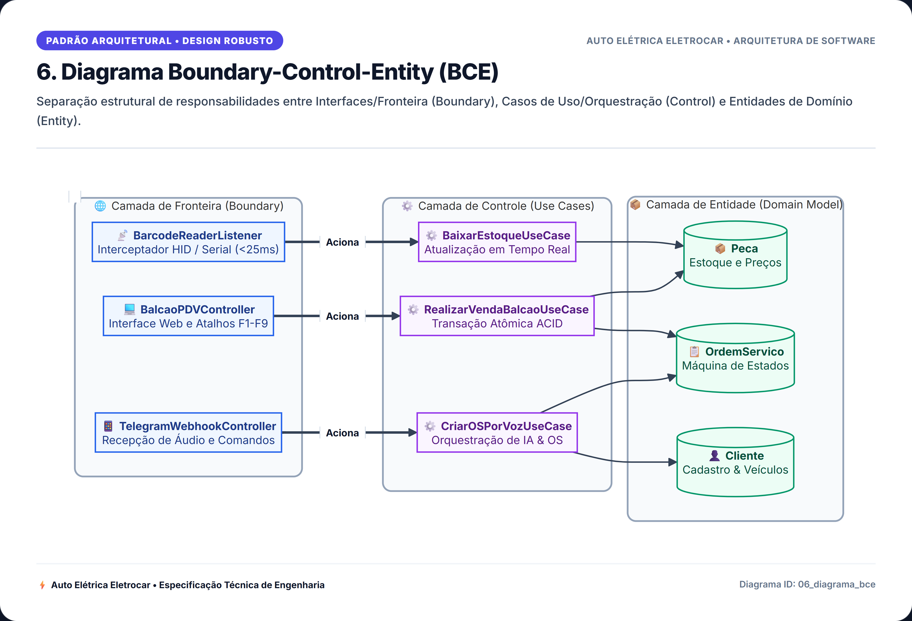
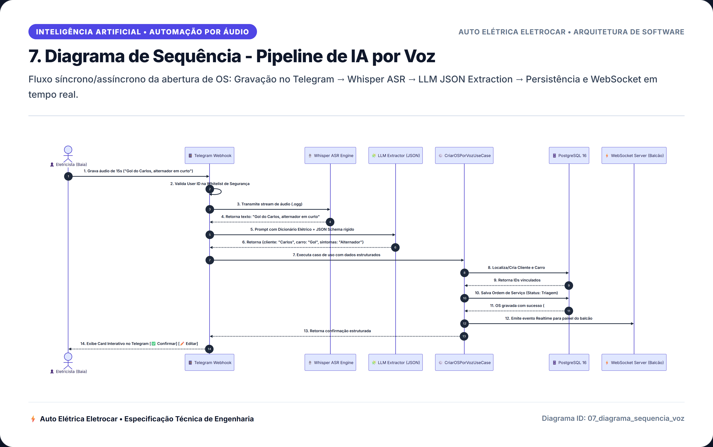
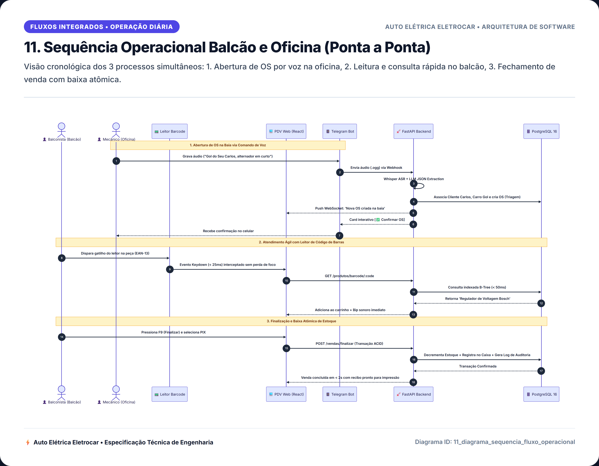
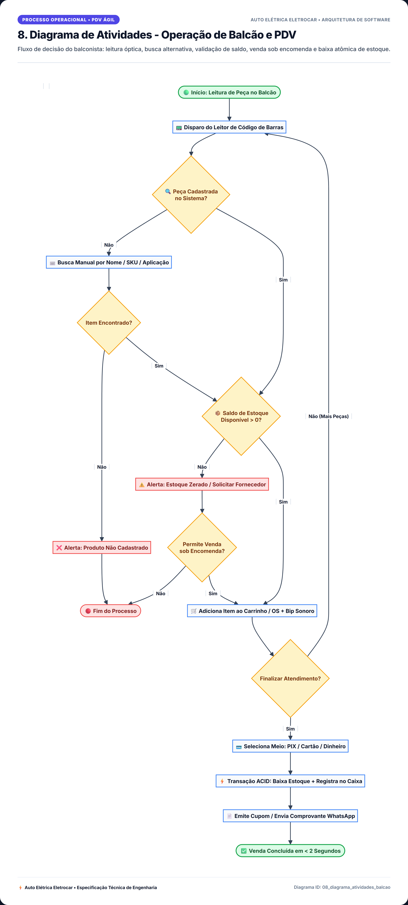

# 📽️ Apresentação Executiva e Técnica — Auto Elétrica Eletrocar
## Proposta de Especificação, Arquitetura e Engenharia de Software

> **Formato de Referência**: Padrão executivo/acadêmico de 42 slides (UML + DDD + Clean Architecture + TDD + Hardware I/O + IA).  
> **Versão Interativa Web**: [`docs/apresentacao/index.html`](./apresentacao/index.html) — Apresentação em tela cheia com navegação por teclado e exportação para PDF.  
> **Catálogo Visual de Diagramas**: [`docs/diagramas/README.md`](./diagramas/README.md) — 12 diagramas em 4K Ultra-HD e vetoriais SVG.

---

# Sumário da Apresentação (42 Slides)

```
01 · Capa Executiva — Sistema Auto Elétrica Eletrocar
02 · Sumário e Agenda da Apresentação
03 · Contexto e Escopo — Por que este sistema existe
04 · Arquitetura de Referência — Stack Tecnológico
05 · Seção 01 · Requisitos Funcionais (1/2)
06 · Seção 01 · Requisitos Funcionais (2/2)
07 · Seção 01 · Requisitos Não Funcionais
08 · Seção 02 · Atores do Sistema e RBAC
09 · Seção 02 · Diagrama de Casos de Uso (Geral)
10 · Seção 02 · Casos de Uso — Foco Balcão & Leitor de Barcode
11 · Seção 02 · Casos de Uso — Foco Oficina & Telegram Voice Bot
12 · Seção 02 · Casos de Uso — Foco Gestão, DRE & Dono Multi-Papel
13 · Seção 02 · Casos de Uso Principais — Descrição Textual
14 · Seção 03 · Diagrama de Classes de Domínio (Geral)
15 · Seção 03 · Diagrama de Classes — Usuários, Papéis e RBAC
16 · Seção 03 · Diagrama de Classes — Clientes, Veículos e Ordens de Serviço
17 · Seção 03 · Diagrama de Classes — Peças, Estoque, Vendas e Finanças
18 · Seção 03 · Persistência — Local (IndexedDB/PWA) × Remota (PostgreSQL 16)
19 · Seção 03.1 · DER Local — Cache Offline e Fila de Sincronização
20 · Seção 03.1 · DER Remoto — Módulo de Usuários e Clientes
21 · Seção 03.1 · DER Remoto — Módulo de Ordens de Serviço e Peças
22 · Seção 03.1 · DER Remoto — Módulo de Vendas no Balcão e Caixa
23 · Seção 03.1 · DER Remoto — Modelo Físico Completo (PostgreSQL 16)
24 · Seção 03.1 · DER Remoto — Integridade Referencial e Transações ACID
25 · Seção 03.1 · DER Remoto — Índices B-Tree e GIN para Alta Performance
26 · Seção 03.1 · Segurança de Dados — Matriz de RBAC e Políticas de Acesso
27 · Seção 04 · Diagrama de Objetos — Runtime Snapshot da Oficina
28 · Seção 05 · Diagrama de Estados — Ciclo de Sincronização e Transações
29 · Seção 05 · Diagrama de Estados — Ciclo de Vida da Ordem de Serviço
30 · Seção 06 · Boundary-Control-Entity — Venda no Balcão e Leitor de Barcode
31 · Seção 06 · Boundary-Control-Entity — Abertura de OS por Voz no Telegram
32 · Seção 06 · Boundary-Control-Entity — Mapeamento por Caso de Uso
33 · Seção 07 · Diagrama de Sequência — Pipeline de IA por Voz (Whisper + LLM)
34 · Seção 07 · Diagrama de Sequência — Fluxo Operacional Balcão e Oficina
35 · Seção 08 · Diagrama de Atividades — Operação de Balcão e Leitor Barcode
36 · Seção 09 · Diagrama de Componentes — Clean Architecture e Gateways
37 · Seção 10 · Implementação — DDD (Aggregates, VOs e Domain Services)
38 · Seção 10 · Implementação — Clean Architecture (Estrutura de Pastas)
39 · Seção 10 · Implementação — TDD (Pirâmide de Testes)
40 · Seção 11 · Fechamento — Checklist de Engenharia de Software (15/15)
41 · Seção 11 · Fechamento — Rastreabilidade RF → Caso de Uso → Teste
42 · Planejamento — Cronograma Executivo de Desenvolvimento (Sprints)
```

---

## Slide 01 · Capa Executiva

**PROPOSTA DE ESPECIFICAÇÃO E ARQUITETURA DE SISTEMAS**
# Sistema Auto Elétrica Eletrocar
### Gestão Operacional de Balcão e Oficina Mecânica — FastAPI, React/PWA, Telegram Voice Bot, Hardware I/O e Clean Architecture

*Auto Elétrica Eletrocar • Engenharia de Software e Especificação Técnica Consolidada*

---

## Slide 02 · Agenda da Apresentação

### SUMÁRIO
* **01 · Contexto e escopo**: Dores da oficina, latência de balcão e decisões arquiteturais
* **02 · Stack de referência**: Frontend PWA, FastAPI, PostgreSQL 16, WebHID e Whisper
* **03 · Requisitos funcionais e não funcionais**: 24 RFs e 8 RNFs críticos
* **04 · Diagrama de casos de uso**: RBAC flexível com acúmulo de papéis para o gestor
* **05 · Diagrama de classes e persistência**: Entidades puras de domínio e agregações DDD
* **06 · Modelo entidade-relacionamento e RBAC**: PostgreSQL 16, chaves e integridade
* **07 · Diagrama de objetos e diagramas de estado**: Snapshot em execução e máquina da OS
* **08 · Boundary-Control-Entity (BCE)**: Robustez em vendas e abertura de OS
* **09 · Diagramas de sequência**: Pipeline de IA de voz e fluxo simultâneo balcão/oficina
* **10 · Diagrama de atividades**: Fluxo ágil no balcão e protocolo temporal do leitor
* **11 · Diagrama de componentes**: Camadas concêntricas da Clean Architecture
* **12 · DDD, Clean Architecture, TDD e cronograma**: Entregáveis, pirâmide e 10 semanas

---

## Slide 03 · Contexto e Escopo

### Por que este sistema existe
* **Problema**: Lentidão no balcão de atendimento, perda de foco ao bipar peças, dificuldade de digitação na oficina suja de graxa, divergências de estoque e falta de DRE/fluxo de caixa preciso.
* **Restrição**: Tempo de resposta inferior a **150ms** no balcão, operação sem mouse via teclas de atalho e resiliência offline em quedas de sinal.
* **Abordagem**: PWA React + FastAPI assíncrono + PostgreSQL 16 + Hardware I/O (WebHID/Serial) + Telegram Voice Bot com Whisper ASR.
* **Método**: UML + DDD + Clean Architecture + TDD (Engenharia de Software rigorosa).

| Decisão Arquitetural | Resumo e Justificativa |
| :--- | :--- |
| **RBAC com Acúmulo de Papéis** | Dono pode atuar como Admin, Balconista e Eletricista sem alternar contas (tabela N:N `USUARIOS_PAPEIS`). |
| **Captura Global de Código de Barras** | Interceptação global de eventos `keydown` com validação temporal delta < 25ms — dispensa foco de cursor. |
| **Abertura de OS por Voz (Telegram)** | Eletricista grava áudio na baia; Whisper ASR transcreve e LLM extrai JSON estruturado em < 5 segundos. |
| **Integridade Transacional Rigorosa** | Transações ACID no PostgreSQL 16 com bloqueio otimista de estoque e auditoria imutável de caixa. |

---

## Slide 04 · Arquitetura de Referência — Stack Tecnológico

| Camada | Escolha | Observação |
| :--- | :--- | :--- |
| **Framework Frontend** | React 18 + TypeScript + TailwindCSS | PWA instalável nativamente no Windows e Mobile; UI instantânea. |
| **Resiliência Local** | Service Workers + IndexedDB + Cache API | Consulta de catálogo offline e rascunhos com Background Sync. |
| **Backend / API** | Python 3.12 (FastAPI) + AsyncIO + SQLAlchemy 2.0 | Alto throughput assíncrono, validação Pydantic v2 e latência < 50ms. |
| **Autenticação & Sessão** | OAuth2 com JWT + Bcrypt + Refresh Tokens | Stateless seguro, suporte a Lock Screen com PIN para troca de turno. |
| **Banco de Dados** | PostgreSQL 16 | Transações ACID rigorosas, índices B-Tree e GIN para busca ultra-rápida. |
| **Hardware I/O** | USB / Bluetooth HID + WebHID / Web Serial | Detecção de conexão em tempo real e captura de bip sem foco. |
| **IA & Voz** | Telegram Bot API + Whisper ASR + LLM Extraction | Criação de OS sem as mãos na oficina automotiva. |
| **Notificação em Tempo Real** | WebSockets nativos (FastAPI) | Painel do balcão atualiza imediatamente quando uma OS é criada por voz. |
| **Infraestrutura / DevOps** | Docker + Docker Compose + Nginx | Isolamento, baixo custo operacional de VPS e deploy previsível. |
| **Testes Automatizados** | Pytest (Backend) + Vitest / Testing Library (Front) | Cobertura em camadas: Domínio, Use Cases, Gateways e Mocks de Hardware. |

---

## Slide 05 · Requisitos Funcionais (1/2)

| ID | Descrição | Prioridade | Ator |
| :--- | :--- | :--- | :--- |
| **RF01** | Autenticar usuários via usuário/senha com suporte a múltiplos papéis (RBAC) | Alta | Administrador / Todos |
| **RF02** | Permitir bloqueio rápido de terminal (Lock Screen) com PIN para troca de operador | Alta | Balconista |
| **RF03** | Registrar venda rápida no balcão em menos de 10 segundos com teclas de atalho | Alta | Balconista |
| **RF04** | Capturar código de barras de peças automaticamente sem necessidade de foco prévio | Alta | Balconista / Hardware |
| **RF05** | Detectar status de conexão de leitor USB/Bluetooth via WebHID/Serial em tempo real | Média | Sistema / Hardware |
| **RF06** | Consultar peças por código original de fabricante (Bosch, Delphi, Magneti Marelli) | Alta | Balconista / Eletricista |
| **RF07** | Permitir busca por aplicação de veículo (Ex: "Alternador Gol G5 1.6") | Alta | Balconista |
| **RF08** | Aplicar desconto percentual ou monetário mediante validação de alçada gerencial | Alta | Administrador / Balconista |
| **RF09** | Emitir sinal sonoro de feedback (*Bip*) ao reconhecer peça válida | Média | Sistema / UI |
| **RF10** | Abrir Ordem de Serviço manualmente com checklist elétrico estruturado | Alta | Balconista / Eletricista |
| **RF11** | Abrir Ordem de Serviço por comando de voz gravado no Telegram Bot | Alta | Eletricista |
| **RF12** | Transcrever áudio automotivo via Whisper ASR e extrair JSON via LLM | Alta | Sistema / IA |

---

## Slide 06 · Requisitos Funcionais (2/2)

| ID | Descrição | Prioridade | Ator |
| :--- | :--- | :--- | :--- |
| **RF13** | Notificar balcão via WebSocket assim que uma OS for gerada por voz | Alta | Sistema |
| **RF14** | Atualizar status da OS ao longo das 9 etapas do ciclo de vida | Alta | Eletricista / Balconista |
| **RF15** | Alocar peças do estoque para a OS com reserva e baixa automática | Alta | Sistema |
| **RF16** | Controlar múltiplos carros vinculados ao mesmo cliente (cadastro simplificado) | Alta | Balconista |
| **RF17** | Registrar sangrias, suprimentos e controle de turnos de caixa | Alta | Balconista |
| **RF18** | Executar fechamento cego de caixa (sem exibir o saldo teórico ao operador) | Alta | Balconista / Administrador |
| **RF19** | Emitir DRE Gerencial contendo Receita Bruta, CMV, Mão de Obra e Lucro Líquido | Alta | Administrador |
| **RF20** | Gerar QR Code PIX dinâmico com confirmação automática de liquidação | Alta | Sistema / Balconista |
| **RF21** | Registrar logs de auditoria imutáveis para alterações de preço, estoque e cancelamentos | Alta | Sistema |
| **RF22** | Gerar orçamento e recibo em PDF térmico (80mm/58mm) e envio via WhatsApp | Alta | Balconista |
| **RF23** | Disparar alertas de estoque mínimo e sugestão de compra por giro médio | Média | Administrador |
| **RF24** | Manter funcionamento do balcão em modo offline com sincronização posterior | Alta | Sistema / PWA |

---

## Slide 07 · Requisitos Não Funcionais

| ID | Categoria | Descrição e Critério Mensurável |
| :--- | :--- | :--- |
| **RNF01** | **Desempenho** | Tempo de resposta na leitura óptica e adição ao carrinho inferior a **150ms**; busca textual em menos de **50ms**. |
| **RNF02** | **Disponibilidade / Offline** | Aplicação frontend deve operar como PWA instalável; catálogo e rascunhos funcionam offline via IndexedDB. |
| **RNF03** | **Hardware I/O** | Interceptador global deve distinguir digitação humana (80–200ms/tecla) de leitor óptico (< 25ms/tecla) e suprimir `Enter`. |
| **RNF04** | **Inteligência Artificial** | Processamento completo de áudio (Telegram → Whisper → LLM → OS criada) em menos de **5 segundos**. |
| **RNF05** | **Integridade de Dados** | Todas as baixas de estoque e conciliações financeiras devem respeitar isolamento de transação ACID no PostgreSQL 16. |
| **RNF06** | **Segurança & RBAC** | Senhas com hash Bcrypt (fator 12), tokens JWT com rotação e sanitização estrita contra injeção SQL via SQLAlchemy 2.0. |
| **RNF07** | **Usabilidade em Oficina** | Operação 100% por teclas de atalho no balcão ("Zero Mouse") e operação "Mãos Livres" na oficina via comando de voz. |
| **RNF08** | **Compatibilidade** | Suporte a navegadores modernos com WebHID (Chrome, Edge, Opera) no Windows e navegadores mobile no Android/iOS. |

---

## Slide 08 · Atores do Sistema e RBAC Multi-Papel

| Ator | Tipo | Papel e Responsabilidades |
| :--- | :--- | :--- |
| **Administrador (Gestor / Dono)** | Usuário Autenticado | Gestão financeira (DRE, Fluxo de Caixa), parametrização, gestão de estoque e auditoria. Pode acumular papéis operacionais. |
| **Balconista / Atendente** | Usuário Autenticado | Atendimento ágil no balcão, registro de vendas via leitor de código de barras, abertura manual de OS e recebimento de pagamentos. |
| **Eletricista / Mecânico** | Usuário Autenticado | Execução de serviços na baia, gravação de áudios no Telegram para abertura de OS, apontamento de diagnóstico e requisição de peças. |
| **Dono da Oficina (Multi-Perfil)** | Usuário Autenticado | Perfil híbrido que acumula simultaneamente as funções de Administrador, Balconista e Eletricista sem restrições. |
| **Leitor de Código de Barras** | Ator Externo de Hardware | Emissão contínua de sequências HID ou porta serial virtual conectada à porta USB ou emparelhada via Bluetooth. |
| **Telegram Voice Bot / Whisper** | Ator Externo de IA | Recebimento de arquivos de áudio (.oga/.ogg), transcrição acústica em português e extração estruturada de entidades. |
| **Gateway de Pagamento / PIX** | Sistema Externo | Geração dinâmica de chaves copia-e-cola e QR Code PIX com webhook de liquidação financeira. |
| **PostgreSQL 16** | Sistema de Persistência | Fonte central da verdade para todas as entidades de domínio com consistência ACID rigorosa. |

---

## Slide 09 · Diagrama de Casos de Uso (Visão Geral)


> **Destaque**: Herança de perfis e acúmulo flexível de papéis. O Administrador pode herdar tanto as ações do Balconista quanto do Eletricista.

---

## Slide 10 · Casos de Uso — Foco Balcão & Leitor de Barcode

* **UC02: Realizar Venda no Balcão**: Caso de uso primário do operador de balcão. Opera com fluxo contínuo de adição de itens.
* **`<<include>>` UC03: Ler Código de Barras**: Executado de forma automática e transparente ao acionar o leitor físico.
* **`<<extend>>` UC04: Aplicar Desconto Gerencial**: Condicional à validação do valor ou senha de supervisor caso ultrapasse a margem pré-configurada.
* **Feedback I/O**: Emissão de alerta sonoro imediato e atualização do painel de itens sem perder o foco na tela de atendimento.

---

## Slide 11 · Casos de Uso — Foco Oficina & Telegram Voice Bot

* **UC06: Enviar Áudio Telegram / IA**: O eletricista grava mensagem de voz relatando o problema do veículo diretamente da baia de trabalho.
* **`<<include>>` UC05: Abrir Ordem de Serviço**: O processamento em backend gera a OS de forma automática com dados estruturados.
* **`<<extend>>` Alocação de Peças**: Se o áudio mencionar componentes necessários (ex: "bateria 60Ah Moura"), o sistema já reserva as peças no estoque.
* **Notificação WebSocket**: Alerta visual na tela do balcão indicando que uma nova OS foi recebida para precificação ou aprovação.

---

## Slide 12 · Casos de Uso — Foco Gestão, DRE & Dono Multi-Papel

* **UC01: Autenticar com Multi-Perfis**: Login único que carrega todas as permissões concedidas na tabela associativa `USUARIOS_PAPEIS`.
* **UC07: Emitir DRE e Relatórios Contábeis**: Cálculo analítico de Receita Líquida, Custos de Peças (CMV), Custos de Mão de Obra e Margem Operacional.
* **UC10: Fechamento Cego de Caixa**: Conferência de sangrias e contagem manual de cédulas sem visualização antecipada do saldo teórico.
* **Auditoria Contínua**: Gravação de logs com IP, usuário, data/hora e dados antes/depois para qualquer cancelamento ou desconto.

---

## Slide 13 · Casos de Uso Principais — Descrição Textual

### UC02 — Realizar Venda no Balcão
* **Ator Principal**: Balconista (ou Dono com papel de Balconista).
* **Pré-condições**: Usuário autenticado e caixa do turno aberto.
* **Fluxo Principal**: 
  1. Balconista pressiona `F2` para nova venda.
  2. Aponta o leitor e bipa os códigos de barras das peças (`UC03`).
  3. Sistema valida estoque, emite bip e adiciona ao carrinho (< 150ms).
  4. Balconista pressiona `F9` para finalizar e escolhe o meio de pagamento (PIX, Cartão ou Dinheiro).
  5. Sistema registra transação ACID, baixa estoque e gera recibo térmico.
* **Pós-condições**: Estoque atualizado no PostgreSQL e caixa creditado.

### UC06 — Enviar Áudio Telegram para Abertura de OS
* **Ator Principal**: Eletricista.
* **Pré-condições**: `telegram_user_id` cadastrado e autorizado na whitelist.
* **Fluxo Principal**:
  1. Eletricista grava áudio no bot do Telegram ("Gol do seu Carlos, motor de partida patinando").
  2. Webhook envia áudio para o Whisper ASR.
  3. LLM extrai JSON estruturado com Cliente, Veículo e Sintomas.
  4. Backend localiza/cria cliente e salva a OS no status `ORCAMENTO_CRIADO`.
  5. WebSockets notificam o painel de balcão e bot retorna confirmação com botões inline no Telegram.

---

## Slide 14 · Diagrama de Classes de Domínio (Visão Geral)


> **Destaque**: Modelo de domínio puro, isolado de frameworks externos. Entidades ricas com comportamentos de validação e métodos de negócio.

---

## Slide 15 · Classes: Usuários, Papéis e RBAC Multi-Perfil

* **`Usuario`**: Entidade central de segurança (`id`, `nome`, `email`, `senha_hash`, `pin_rapido`, `telegram_id`, `ativo`).
  * Métodos: `autenticar()`, `validar_pin()`, `possui_papel()`, `acumular_papeis()`.
* **`Papel`**: Define o escopo de atuação (`ADMIN`, `BALCONISTA`, `ELETRICISTA`).
* **`UsuarioPapel`**: Tabela associativa com chave composta e data de concessão, permitindo que um mesmo colaborador acumule múltiplos perfis de acesso.

---

## Slide 16 · Classes: Clientes, Veículos e Ordens de Serviço

* **`Cliente`**: Cadastro simplificado de alta agilidade (`id`, `nome`, `cpf_cnpj`, `telefone`, `tipo_cliente`).
* **`Veiculo`**: Automóvel vinculado ao cliente (`placa`, `modelo`, `montadora`, `ano_fabricacao`). Um cliente pode possuir múltiplos veículos.
* **`OrdemServico`**: Raiz de Agregação principal (`numero_os`, `status`, `sintomas_relatados`, `checklist_eletrico`, `valor_total`).
  * Métodos: `adicionar_peca()`, `adicionar_servico()`, `aprovar()`, `concluir_diagnostico()`, `finalizar()`.
* **`ItemOS` & `Servico`**: Itens e serviços atrelados à OS com discriminação de valores e mecânico executor.

---

## Slide 17 · Classes: Peças, Estoque, Vendas e Finanças

* **`Peca`**: Peça ou componente elétrico (`id`, `sku`, `codigo_barras`, `codigo_original_fabricante`, `descricao`, `preco_venda`, `estoque_atual`, `estoque_minimo`).
  * Métodos: `reservar()`, `dar_baixa()`, `estornar()`, `validar_saldo()`.
* **`VendaBalcao`**: Agregação de venda rápida (`id`, `data_venda`, `operador_id`, `desconto_aplicado`, `valor_final`, `status`).
* **`ItemVenda`**: Linha de item vendido com quantidade, valor unitário e subtotal.
* **`TransacaoFinanceira`**: Registro financeiro contábil atrelado à venda ou OS (`tipo`, `valor`, `meio_pagamento`, `status_conciliacao`).

---

## Slide 18 · Persistência Local (PWA) × Remota (PostgreSQL 16)

| Entidade de Domínio | Local (IndexedDB / PWA) | Remota (PostgreSQL 16) | Estratégia de Sincronização |
| :--- | :--- | :--- | :--- |
| **`Usuario` & `Papel`** | Cache de Sessão (JWT / PIN) | Fonte da Verdade | Somente leitura local; revalidação a cada 4 horas. |
| **`Peca` (Catálogo)** | Cache Local Completo | Fonte da Verdade | Download inicial + atualização via Delta (`updated_at`). |
| **`Cliente` & `Veiculo`** | Cache de Busca Rápida | Fonte da Verdade | Consulta remota prioritária com fallback para cache local. |
| **`VendaBalcao`** | Fila Local (Outbox) | Fonte da Verdade | Gravação síncrona na fila local e envio assíncrono à API. |
| **`OrdemServico`** | Rascunhos Locais | Fonte da Verdade | Criação offline suportada; sincronização ao reconectar. |
| **`TransacaoFinanceira`**| Não armazenado | Fonte da Verdade | Exclusivamente remota; exige confirmação do servidor. |
| **`SyncQueue`** | Exclusivo Local | Inexistente | Fila transacional de background com retry e backoff exponencial. |

---

## Slide 19 · DER Local — Cache Offline e Fila de Sincronização

* **`TB_CATALOGO_OFFLINE`**: Espelho enxuto de peças (`sku`, `barcode`, `descricao`, `preco`, `estoque_saldo`) para permitir vendas mesmo com internet inoperante.
* **`TB_RASCUNHOS_OS`**: Armazenamento temporário de formulários de OS em preenchimento, prevenindo perda de dados por fechamento acidental de aba.
* **`TB_SYNC_QUEUE`**: Fila FIFO com status (`PENDING`, `SYNCING`, `SYNCED`, `ERROR`), contadores de retentativa e payload JSON serializado.

---

## Slide 20 · DER Remoto — Módulo de Usuários e Clientes

* **Tabelas**: `USUARIOS`, `PAPEIS`, `USUARIOS_PAPEIS`, `CLIENTES`, `VEICULOS`.
* **Chaves e Relações**:
  * `USUARIOS.id` (UUID PK) ↔ `USUARIOS_PAPEIS.usuario_id` (FK).
  * `PAPEIS.id` (INT PK) ↔ `USUARIOS_PAPEIS.papel_id` (FK).
  * `CLIENTES.id` (UUID PK) ↔ `VEICULOS.cliente_id` (FK 1:N).
* **Integridade**: Restrição UNIQUE em `CLIENTES.cpf_cnpj` (quando informado) e `VEICULOS.placa`.

---

## Slide 21 · DER Remoto — Módulo de Ordens de Serviço e Peças

* **Tabelas**: `ORDENS_SERVICO`, `ITENS_OS`, `SERVICOS`, `PECAS`, `FABRICANTES`.
* **Chaves e Relações**:
  * `ORDENS_SERVICO.id` (UUID PK) ↔ `ITENS_OS.ordem_servico_id` (FK CASCADE).
  * `PECAS.id` (UUID PK) ↔ `ITENS_OS.peca_id` (FK).
  * `SERVICOS.id` (INT PK) ↔ `ITENS_OS.servico_id` (FK).
* **Campos de Controle**: `status_os` (Enum com 9 estados), `checklist_eletrico` (JSONB), `origem_abertura` (`BALCAO` / `TELEGRAM_VOICE`).

---

## Slide 22 · DER Remoto — Módulo de Vendas no Balcão e Caixa

* **Tabelas**: `VENDAS_BALCAO`, `ITENS_VENDA`, `TRANSACOES_FINANCEIRAS`, `FECHAMENTOS_CAIXA`.
* **Chaves e Relações**:
  * `VENDAS_BALCAO.id` (UUID PK) ↔ `ITENS_VENDA.venda_id` (FK CASCADE).
  * `VENDAS_BALCAO.id` ↔ `TRANSACOES_FINANCEIRAS.venda_id` (FK Nullable).
  * `USUARIOS.id` ↔ `FECHAMENTOS_CAIXA.operador_id` (FK).
* **Garantia ACID**: Transação atômica que vincula gravação da venda, dedução de estoque e crédito no caixa.

---

## Slide 23 · DER Remoto — Modelo Físico Completo (PostgreSQL 16)



> **Estrutura Completa**: Esquema relacional normalizado no PostgreSQL 16 com integridade referencial estrita e suporte a RBAC multi-perfil.

---

## Slide 24 · Integridade Referencial e Transações ACID

* **Isolamento `READ COMMITTED`**: Previne leituras sujas em momentos de concorrência simultânea entre balcão e oficina.
* **Bloqueio Otimista / `SELECT FOR UPDATE`**: Garante que duas vendas simultâneas da última unidade de uma peça não resultem em estoque negativo.
* **Cascata Controlada**: Exclusão de rascunhos limpa itens filhos (`ON DELETE CASCADE`), mas vendas faturadas possuem exclusão lógica (`deleted_at`) e integridade bloqueada (`RESTRICT`).

---

## Slide 25 · Índices B-Tree e GIN para Alta Performance

* **Índices B-Tree**:
  * `CREATE INDEX idx_pecas_barcode ON pecas(codigo_barras);` → Resposta de leitura óptica em < 5ms.
  * `CREATE INDEX idx_pecas_codigo_fab ON pecas(codigo_original_fabricante);` → Busca imediata por código Bosch/Delphi.
  * `CREATE INDEX idx_veiculos_placa ON veiculos(placa);` → Identificação do automóvel no balcão.
* **Índices GIN (Generalized Inverted Index)**:
  * `CREATE INDEX idx_pecas_busca_gin ON pecas USING gin(to_tsvector('portuguese', descricao));` → Busca textual com autocompletar instantâneo.
  * `CREATE INDEX idx_os_checklist ON ordens_servico USING gin(checklist_eletrico);` → Filtros rápidos por tipo de defeito elétrico.

---

## Slide 26 · Segurança de Dados — Matriz RBAC e Acesso

| Tabela / Recurso | Administrador / Dono | Balconista / Atendente | Eletricista / Mecânico |
| :--- | :--- | :--- | :--- |
| `USUARIOS`, `PAPEIS` | Leitura / Escrita total | Acesso negado | Acesso negado |
| `PECAS` (Estoque) | Leitura / Ajuste manual / Preço | Leitura / Baixa automática | Leitura / Consulta de saldo |
| `VENDAS_BALCAO` | Leitura / Cancelamento / Desconto | Criar / Consultar próprias | Acesso negado |
| `ORDENS_SERVICO` | Leitura / Aprovação / Faturamento | Criar / Consultar / Recibo | Criar por voz / Atualizar status |
| `FINANCEIRO` / `DRE` | Leitura analítica e fechamento | Abertura / Fechamento cego | Acesso negado |
| `LOGS_AUDITORIA` | Leitura somente (imutável) | Acesso negado | Acesso negado |

---

## Slide 27 · Diagrama de Objetos — Runtime Snapshot da Oficina



> **Cenário de Execução Real**: O usuário `usr_dono` opera com múltiplos papéis simultâneos; a OS `os_1049` vincula o veículo Gol do cliente João; a peça Bosch é alocada e o status permanece `EM_EXECUCAO`.

---

## Slide 28 · Diagrama de Estados — Ciclo de Sincronização Local × Remoto

* **Estados da Entidade no Cliente**:
  1. `RASCUNHO_CRIADO`: Objeto salvo apenas em IndexedDB.
  2. `NA_FILA_SYNC`: Enfileirado no `SyncQueueItem` local.
  3. `SINCRONIZANDO`: Payload sendo transmitido via HTTPS/REST.
  4. `SINCRONIZADO`: Confirmação 200 OK do servidor com `updated_at` atualizado.
  5. `ERRO_SYNC`: Falha de rede ou conflito de validação; aciona retentativa com backoff exponencial.

---

## Slide 29 · Diagrama de Estados — Ciclo de Vida da Ordem de Serviço


* **Fluxo da Máquina de Estados**:
  `ORCAMENTO_CRIADO` → `AGUARDANDO_APROVACAO` → `APROVADO` → `EM_EXECUCAO` → `AGUARDANDO_PECA` → `TESTE_ELETRICO` → `FINALIZADO` → `ENTREGUE_FATURADO` (ou `CANCELADO`).

---

## Slide 30 · BCE — Venda no Balcão e Leitor de Barcode



* **Boundary**: `BalcaoScreen`, `BarcodeScannerGateway` (WebHID / Keyboard Wedge), `AudioBipGateway`.
* **Control**: `RealizarVendaUseCase`, `ValidarEstoqueUseCase`, `ProcessarPagamentoUseCase`.
* **Entity**: `VendaBalcao`, `ItemVenda`, `Peca`, `TransacaoFinanceira`.

---

## Slide 31 · BCE — Abertura de OS por Voz no Telegram

* **Boundary**: `TelegramBotWebhook`, `WhisperGateway`, `LLMParserGateway`, `WebSocketBalcaoNotifier`.
* **Control**: `CriarOrdemServicoVozUseCase`, `IdentificarClienteCarroUseCase`.
* **Entity**: `OrdemServico`, `Cliente`, `Veiculo`, `ChecklistEletrico`.

---

## Slide 32 · BCE — Mapeamento por Caso de Uso (Amostra)

| Caso de Uso | Boundary UI / Hardware | Boundary Nativo / Externo | Control (Use Case) | Entities |
| :--- | :--- | :--- | :--- | :--- |
| **UC02: Venda Balcão** | `BalcaoVendaScreen` | `BarcodeReaderGateway` | `RealizarVendaUseCase` | `VendaBalcao`, `Peca`, `ItemVenda` |
| **UC06: Áudio Telegram** | — | `TelegramWebhook`, `WhisperASR` | `CriarOSPorVozUseCase` | `OrdemServico`, `Cliente`, `Veiculo` |
| **UC07: Emitir DRE** | `DREDashboardScreen` | `PdfPrinterGateway` | `GerarDREUseCase` | `TransacaoFinanceira`, `VendaBalcao` |
| **UC08: Atualizar OS** | `OficinaKanbanScreen` | `WebSocketGateway` | `AtualizarStatusOSUseCase`| `OrdemServico`, `ItemOS` |
| **UC10: Fechar Caixa** | `FechamentoCaixaModal`| `ThermalPrinterGateway` | `FechamentoCegoUseCase` | `FechamentoCaixa`, `Transacao` |

---

## Slide 33 · Diagrama de Sequência — Pipeline de IA por Voz



> **Linha do Tempo**: O mecânico envia áudio no Telegram → Webhook aciona Whisper ASR → LLM extrai JSON estruturado com terminologia automotiva → OS gravada no PostgreSQL → WebSocket avisa o balcão em tempo real.

---

## Slide 34 · Diagrama de Sequência — Operação Integrada Balcão e Oficina



> **Operação Simultânea**: Processo 1 (Abertura de OS por voz no pátio), Processo 2 (Consulta rápida de peças pelo leitor no balcão) e Processo 3 (Fechamento de venda com baixa atômica de estoque).

---

## Slide 35 · Diagrama de Atividades — Balcão & Leitor Barcode



* **Protocolo de Captura**: Interceptação global de eventos `keydown` com validação de cadência (< 25ms/tecla) para diferenciar leitor óptico de operador humano e prevenção de submit acidental do formulário.

---

## Slide 36 · Diagrama de Componentes — Clean Architecture


* **Regra de Dependência**: O núcleo de Domínio (`Domain`) e os Casos de Uso (`Application`) nunca dependem de frameworks externos ou bibliotecas de hardware. Todas as dependências apontam para dentro via Inversão de Controle (DIP).

---

## Slide 37 · DDD — Aggregates, Value Objects e Domain Services

| Aggregate Root | Entidades Internas | Value Objects | Repositório |
| :--- | :--- | :--- | :--- |
| **`OrdemServico`** | `ItemOS`, `Servico`, `ChecklistEletrico` | `NumeroOS`, `StatusOS`, `PlacaVeiculo`, `Moeda` | `OrdemServicoRepository` |
| **`VendaBalcao`** | `ItemVenda`, `Desconto` | `CodigoBarras`, `Quantidade`, `Moeda` | `VendaBalcaoRepository` |
| **`Usuario`** | `Papel`, `Sessao` | `Email`, `SenhaHash`, `PinRapido` | `UsuarioRepository` |
| **`Peca`** | `HistoricoMovimentacao` | `Sku`, `CodigoOriginal`, `SaldoEstoque` | `PecaRepository` |

* **Domain Services**:
  * `ValidacaoEstoqueService`: Regra atômica que impede venda de item sem saldo disponível.
  * `CalculoDREService`: Consolidação de CMV, receitas e despesas operacionais.
  * `ExtracaoTermosEletricosService`: Validação e calibração de vocabulário técnico de auto elétrica.

---

## Slide 38 · Clean Architecture — Estrutura de Pastas

```
src/
├── domain/                  # Entidades puras, Value Objects, Domain Services, Interfaces
│   ├── entities/            # Usuario, OrdemServico, Peca, VendaBalcao
│   ├── value_objects/       # PlacaVeiculo, CodigoBarras, Moeda
│   ├── repositories/        # Interfaces abstratas de persistência
│   └── gateways/            # Interfaces de hardware (IBarcodeReader, ITelegramVoice)
├── application/             # Casos de uso da aplicação (Use Cases)
│   ├── use_cases/           # RealizarVendaUseCase, CriarOSVozUseCase, EmitirDREUseCase
│   └── dtos/                # Data Transfer Objects com validação Pydantic v2
├── adapters/                # Controladores, Presenters e Gateways concretos
│   ├── controllers/         # Rotas FastAPI REST e Handlers de WebSocket
│   ├── gateways/            # BarcodeGateway, TelegramBotGateway, WhisperAdapter
│   └── repositories/        # Implementações SQLAlchemy 2.0
└── infra/                   # Drivers, Frameworks, Configurações e Banco de Dados
    ├── db/                  # PostgreSQL 16 engine, migrations Alembic
    ├── cache/               # Redis / IndexedDB client
    └── hardware/            # WebHID e Web Serial device listeners
```

---

## Slide 39 · TDD — Pirâmide de Testes

* **1. Domínio (Unitários Puros)**: Sem mocks. Validação de regras de negócio em `Peca.dar_baixa()`, `OrdemServico.validar_transicao()` e cálculos monetários.
* **2. Casos de Uso (Application)**: Testes com *fakes in-memory* de repositórios e gateways de hardware/IA.
* **3. Gateways & Hardware**: Mocks controlados de WebHID, porta Serial, Whisper ASR e Webhook do Telegram.
* **4. Repositórios & Banco**: Testes de integração no PostgreSQL real via Testcontainers com validação de concorrência e integridade ACID.
* **5. API & Rotas**: Testes assíncronos de endpoint via `HTTPX / TestClient` do FastAPI.
* **6. Interface & PWA**: Testes de componentes React e fluxo completo de leitor via Vitest e Testing Library.

---

## Slide 40 · Checklist de Engenharia de Software (15/15)

* [x] **01 · Requisitos Funcionais e Não Funcionais**: 24 RFs e 8 RNFs estruturados e mensuráveis.
* [x] **02 · Diagrama de Casos de Uso (UML)**: Atores, RBAC com múltiplos papéis, include e extend.
* [x] **03 · Descrição Textual de Casos de Uso**: Fluxos principais, alternativos e pós-condições.
* [x] **04 · Diagrama de Classes de Domínio**: Entidades puras, visibilidade, métodos e multiplicidade.
* [x] **05 · Persistência Local × Remota**: Estratégia de cache offline PWA e fonte da verdade no PostgreSQL.
* [x] **06 · DER Relacional Normalizado**: Tabelas, chaves primárias/estrangeiras e integridade referencial.
* [x] **07 · Diagrama de Objetos**: Cenário concreto em runtime com instâncias ativas da oficina.
* [x] **08 · Diagramas de Estado**: Máquina de estados da Ordem de Serviço e ciclo de sincronização.
* [x] **09 · Boundary-Control-Entity (BCE)**: Diagramas de robustez para vendas e pipeline de voz.
* [x] **10 · Diagramas de Sequência**: Fluxo síncrono e assíncrono com IA de voz e balcão/oficina.
* [x] **11 · Diagrama de Atividades**: Processo operacional de balcão e protocolo temporal do leitor.
* [x] **12 · Diagrama de Componentes**: Clean Architecture concêntrica respeitando o DIP.
* [x] **13 · Mapeamento DDD**: Aggregate Roots, Value Objects, Domain Services e Repositórios.
* [x] **14 · Estrutura de Camadas Clean Arch**: Divisão clara de pastas sem acoplamento externo.
* [x] **15 · Rastreabilidade e Plano de Testes**: Matriz de requisitos até os testes e cronograma executivo.

---

## Slide 41 · Rastreabilidade RF → Caso de Uso → Teste de Aceitação

| RF / RNF | Caso de Uso | Teste de Aceitação Automatizado |
| :--- | :--- | :--- |
| **RF01** | `UC01: Autenticar` | `test_auth_multi_role_success`: valida permissões combinadas de Admin e Balconista. |
| **RF04** | `UC03: Ler Barcode`| `test_barcode_temporal_buffer`: valida delta < 25ms e rejeição de digitação manual. |
| **RF11** | `UC06: Áudio Telegram`| `test_voice_os_creation_pipeline`: mock de Whisper e LLM gerando OS no banco em < 5s. |
| **RF15** | `UC05: Alocar Peças` | `test_atomic_stock_deduction`: impede venda simultânea com bloqueio `SELECT FOR UPDATE`. |
| **RF19** | `UC07: Emitir DRE` | `test_dre_calculation_cmv`: valida cálculo contábil com receitas brutas e CMV deduzido. |
| **RNF01**| `UC02: Venda Balcão` | `test_benchmark_item_add_latency`: valida adição ao carrinho em menos de 150ms. |
| **RNF05**| `UC02: Venda Balcão` | `test_acid_transaction_rollback`: simula falha de pagamento e garante rollback de estoque. |

---

## Slide 42 · Cronograma Executivo de Desenvolvimento (10 Semanas)

| Sprint | Prazo | Entregas e Marcos Operacionais | Responsável |
| :--- | :---: | :--- | :--- |
| **Sprint 1** | Semanas 1–2 | Modelagem de Dados, Autenticação JWT/Bcrypt, RBAC e Gestão de Cadastros Base | Equipe Backend & DB |
| **Sprint 2** | Semanas 3–4 | Módulo de Estoque com Leitor de Código de Barras (WebHID/Serial e Cunha) | Equipe Fullstack |
| **Sprint 3** | Semanas 5–6 | Balcão (PDV Rápido), Ordens de Serviço (OS) & Telegram Voice Bot (Voz → OS) | Equipe Fullstack & IA |
| **Sprint 4** | Semanas 7–8 | Módulo Financeiro, Fluxo de Caixa, DRE Gerencial e Meios de Pagamento (PIX) | Equipe Backend & Finance |
| **Sprint 5** | Semana 9 | Testes de Carga, Homologação em Balcão/Oficina e Treinamento da Equipe | Toda a Equipe |
| **Go-Live** | Semana 10 | Entrada em Produção, Monitoramento de Estabilidade e Suporte Assistido | Toda a Equipe |

---

*Apresentação consolidada da Auto Elétrica Eletrocar — Engenharia de Software e Arquitetura de Sistemas.*
