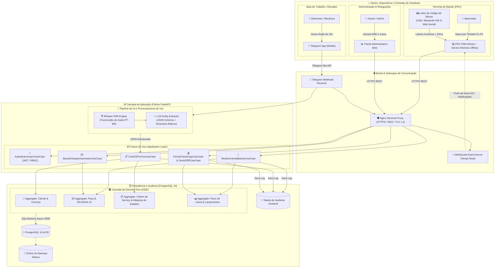
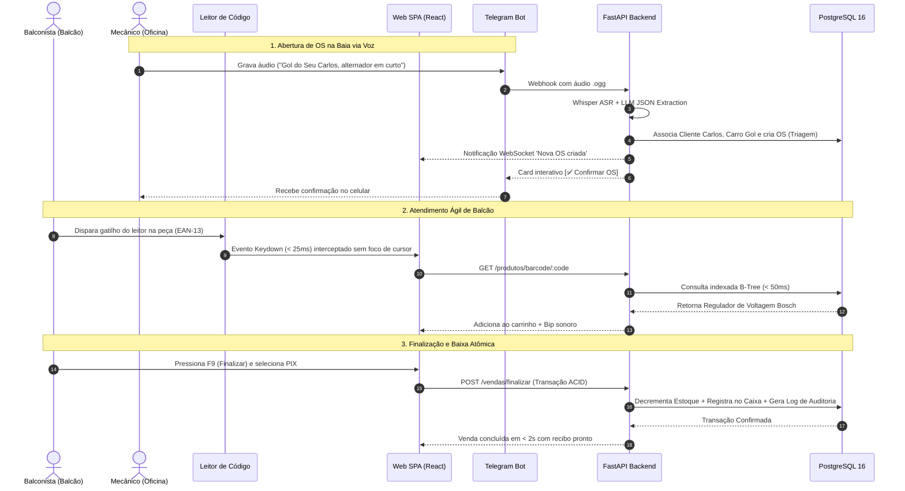

# Diagramas de Arquitetura e Fluxo Operacional
## Auto Elétrica Eletrocar

---

## 1. Visão Geral da Arquitetura do Sistema (Ponta a Ponta)

Este diagrama ilustra a integração completa entre os terminais de atendimento, os dispositivos móveis da oficina, o pipeline de inteligência artificial por voz (Telegram), a API em FastAPI e a persistência relacional em PostgreSQL.

---

## 2. Diagrama de Fluxo Operacional de Balcão e Oficina

---

*Diagramas consolidados de acordo com o padrão de engenharia e especificações da Auto Elétrica Eletrocar.*
