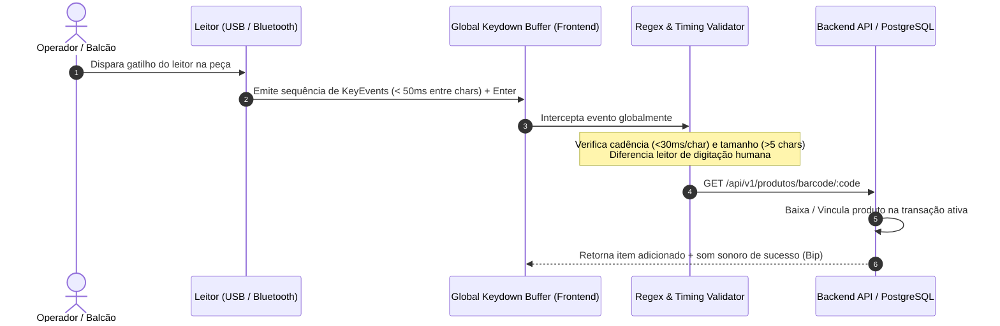
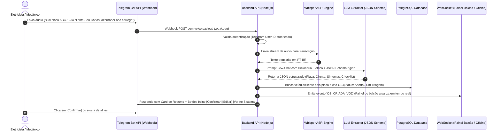

# Especificação Técnica e Proposta Comercial Consolidada
## Sistema de Gestão e Balcão Operacional – Auto Elétrica Eletrocar

---

## 1. Sumário Executivo e Diretrizes Operacionais

O presente documento consolida a arquitetura técnica, os requisitos operacionais rígidos, a proposta comercial e o cronograma executivo para a implantação do sistema integrado da **Auto Elétrica Eletrocar**.

O objetivo primordial é entregar uma solução de alta performance, sem latência em balcão de atendimento, com tolerância a falhas, conciliação financeira rigorosa e integração direta com leitores de código de barras (USB e Bluetooth), reduzindo o tempo de atendimento e eliminando divergências de estoque e caixa.

---

## 2. Pilha Tecnológica e Restrições de Engenharia

Para garantir disponibilidade operacional, tempo de resposta inferior a **150ms** nas operações de balcão e total integridade transacional (ACID), a pilha tecnológica foi padronizada sem dependências desnecessárias:

| Camada | Tecnologia Adotada | Justificativa Técnica e de Custo |
| :--- | :--- | :--- |
| **Frontend / PDV** | **React + TypeScript + TailwindCSS / Vanilla CSS** | Tipagem estática reduz bugs em tempo de execução; SPA leve com renderização instantânea de componentes de balcão. |
| **PWA / Offline Resilience** | **Service Workers + IndexedDB** | Permite registrar itens e consultas de produtos mesmo com instabilidade temporária de rede local. |
| **Backend / API** | **Node.js (Fastify/Express) + TypeScript** | Alto throughput de requisições concorrentes, baixo consumo de memória e fácil integração via WebSockets. |
| **Banco de Dados** | **PostgreSQL 16** | Suporte nativo a transações ACID rigorosas (crítico para financeiro e estoque), índices GIN para busca rápida por placa/chassi/código. |
| **Hardware I/O** | **USB HID / Bluetooth HID (Keyboard Wedge Emulation)** | Compatibilidade universal sem necessidade de instalação de drivers proprietários em terminais Windows/Linux. |
| **Integração Telegram & Voz** | **Telegram Bot API (Webhook) + Whisper ASR + LLM Extraction (JSON)** | Permite abertura imediata de OS via áudio gravado na baia de trabalho sem contato manual com computadores/teclados. |
| **Infraestrutura** | **Docker + Nginx (Hospedagem Híbrida: VPS Cloud + Cache Local)** | Baixo custo operacional mensal, deploys automatizados e redundância de dados diária com backup automatizado. |

---

## 3. Escopo Funcional Detalhado

```
┌─────────────────────────────────────────────────────────────────────────┐
│                      AUTO ELÉTRICA ELETROCAR                            │
├───────────────────┬───────────────────┬─────────────────────────────────┤
│ 1. Balcão & PDV   │ 2. Ordens de      │ 3. Estoque & Peças              │
│    Rápido         │    Serviço (OS)   │    - Leitor USB/Bluetooth       │
│    - Venda rápida │    - Diagnósticos │    - Baixa automática           │
│    - Atalhos (F1) │    - Telegram Bot │    - Ponto de reposição         │
│                   │      (Voz -> OS)  │                                 │
├───────────────────┴───────────────────┴─────────────────────────────────┤
│ 4. Módulo Financeiro & Fluxo de Caixa (DRE, Conciliação, PIX/Cartão)   │
├─────────────────────────────────────────────────────────────────────────┤
│ 5. Cadastro de Clientes, Frotas & Histórico por Placa/Chassi            │
└─────────────────────────────────────────────────────────────────────────┘
```

### 3.1. Tabela de Módulos e Funcionalidades

| Módulo | Funcionalidades Principais | Requisitos de Desempenho / Usabilidade |
| :--- | :--- | :--- |
| **Módulo 1: Balcão & PDV Rápido** | • Abertura e fechamento de venda em menos de 10 segundos.<br>• Consulta instantânea por código de barras, SKU interno, nome ou aplicação do veículo.<br>• Teclas de atalho para todas as ações (`F2` Nova Venda, `F4` Buscar Peça, `F9` Finalizar, `ESC` Cancelar). | • Operação 100% por teclado, dispensando uso de mouse na digitação de itens. |
| **Módulo 2: Ordens de Serviço (OS) & Telegram Voice Bot** | • **Abertura Inteligente via Áudio no Telegram**: o mecânico grava um áudio e a IA transcreve, extrai placa, sintomas, serviços e cria a OS automaticamente.<br>• Abertura manual por Placa com auto-preenchimento dos dados do cliente e histórico.<br>• Registro de sintomas relatados e checklist elétrico (Bateria, Alternador, Motor de Partida, Iluminação, Injeção).<br>• Discriminação de serviços (mão de obra) e peças alocadas.<br>• Status de fluxo: *Orçamento -> Aprovado -> Em Execução -> Aguardando Peça -> Testes -> Finalizado -> Entregue*. | • Processamento de áudio para OS criada em menos de 5 segundos.<br>• Impressão térmica (80mm/58mm) e envio de PDF/orçamento via WhatsApp em 1 clique. |
| **Módulo 3: Estoque Inteligente & Hardware** | • Cadastro com Código de Barras (EAN-13, Code 128) e código original/fabricante (Bosch, Magneti Marelli, etc.).<br>• Baixa automática em tempo real na finalização da OS ou venda no balcão.<br>• Alerta de estoque mínimo e sugestão de compra baseada no giro médio. | • Prevenção de concorrência: bloqueio otimista de registro durante a adição no carrinho. |
| **Módulo 4: Gestão Financeira** | • **Fluxo de Caixa Diário**: controle de sangrias, suprimentos e fechamento de turno.<br>• **DRE Gerencial Simplificado**: Receita bruta, Custo de Mercadorias Vendidas (CMV), Custos de Mão de Obra, Despesas Fixas/Variáveis e Lucro Líquido.<br>• Multi-meios de pagamento: PIX com QR Code dinâmico, Cartão de Crédito/Débito, Boleto e Faturado (para frotas parceiras).<br>• Contas a Pagar e a Receber com controle de inadimplência. | • Auditoria total: todas as alterações de preço ou descontos exigem permissão e geram log imutável. |
| **Módulo 5: Clientes & Veículos** | • Cadastro unificado de Pessoa Física (CPF) e Jurídica (CNPJ).<br>• Vínculo de N veículos por cliente (Placa, Renavam, Chassi, Ano/Modelo, KM atual).<br>• Linha do tempo completa de revisões e manutenções elétricas executadas. | • Busca indexada por Placa com resposta em tempo real (< 50ms). |

---

## 4. Arquitetura de Integração com Hardware e Telegram Voice Bot

### 4.1. Leitor de Código de Barras (USB / Bluetooth HID)
Os leitores operam no modo **HID Keyboard Emulation (Cunha de Teclado)**. O leitor decodifica o código óptico e injeta caracteres ASCII seguidos de `CR` (`Enter`).



---

### 4.2. Telegram Voice Bot: Pipeline de Voz para Ordem de Serviço

O mecânico/eletricista na baia de trabalho (com as mãos ocupadas ou sujas de graxa) pode abrir uma OS instantaneamente gravando uma mensagem de voz no canal/bot do Telegram.



#### Esquema de Dados Extraído do Áudio (JSON Schema Rígido):
```json
{
  "placa_veiculo": "ABC1D23",
  "nome_cliente": "Carlos Silva",
  "veiculo_modelo": "Gol 1.6",
  "sintomas_relatados": "Bateria descarregando constantemente e luz indicadora da bateria acesa no painel.",
  "hipotese_diagnostica": "Possível defeito no alternador (regulador de voltagem ou placa de diodos).",
  "servicos_sugeridos": ["Diagnóstico de alternador", "Teste de fuga de corrente"],
  "checklist_eletrico": {
    "bateria": "Necessita teste de carga",
    "alternador": "Apresenta falha de geração",
    "motor_partida": "Ok"
  },
  "prioridade": "ALTA",
  "origem": "TELEGRAM_VOICE"
}
```

#### Tratamento de Robustez no Chão de Oficina:
1. **Dicionário de Termos Automotivos**: O prompt de extração é calibrado com vocabulário técnico de auto elétrica (*bendix, induzido, estator, regulador de voltagem, relé de partida, chicote, sensor hall, atuador, chave de seta*).
2. **Whitelist de Usuários**: Apenas colaboradores autorizados com `telegram_user_id` cadastrado no sistema podem abrir OS ou requisitar peças.
3. **Resiliência a Ruído**: O modelo ASR é configurado para filtragem de ruído ambiente típico de oficina (compressores, motores e chaves de impacto).

---

## 5. Requisitos de Usabilidade em Ambiente de Oficina

1. **Ergonomia Visual e Iluminação**:
   - Tema com contraste otimizado (UI Dark/Light com alta visibilidade sob luz fluorescente ou solar de galpão).
   - Tipografia com fontes de alta legibilidade (ex: *Inter*, *Roboto Mono* para valores monetários e códigos de peças).
2. **Operação "Zero Mouse" no Balcão e Operação "Mãos Livres" na Oficina**:
   - No balcão: fluxo 100% realizável via atalhos de teclado.
   - Na baia de serviços: operação por comando de voz via Telegram dispensando computadores na área de graxa.
3. **Resiliência a Erros Operacionais**:
   - Confirmações modais críticas via atalhos simples (`Enter` para confirmar, `ESC` para voltar).
   - Sistema de rascunho automático: fechamento acidental da aba não perde os dados da OS em preenchimento.

---

## 6. Segurança, Governança e Conformidade Financeira

| Pilar | Requisito Técnico e Operacional |
| :--- | :--- |
| **Controle de Acesso (RBAC)** | • **Admin/Gestor**: Acesso total, relatórios DRE, cancelamento de vendas e alteração de estoque.<br>• **Atendente/Balcão**: Abertura de OS, emissão de vendas, consulta de peças e recebimento de caixa.<br>• **Eletricista/Oficina**: Acesso ao Telegram Bot autenticado, visualização de OS atribuída, checklist técnico e requisição de peças. |
| **Auditoria e Logs Imutáveis** | Registro estruturado em tabela de auditoria (`logs_auditoria`) contendo: `user_id`, `origem` (Balcão / Telegram Bot), `action`, `payload_before`, `payload_after`, `timestamp`, `ip_address`. |
| **Privacidade (LGPD)** | Criptografia de senhas com bcrypt (custo 12), tráfego 100% via HTTPS/TLS 1.3, anonimização de dados de contato em relatórios públicos. |
| **Fechamento Cego de Caixa** | O operador informa os valores contados fisicamente no fechamento sem visualizar o saldo teórico do sistema; o relatório de quebra de caixa é emitido exclusivamente para a gerência. |

---

## 7. Cronograma Executivo de Entrega (10 Semanas)

```
Semana 01-02: [Sprint 1] Modelagem de Dados, Autenticação, RBAC e Gestão de Cadastros Base
Semana 03-04: [Sprint 2] Módulo de Estoque com Leitor de Código de Barras (USB/BT)
Semana 05-06: [Sprint 3] Balcão (PDV Rápido), Ordens de Serviço (OS) & Telegram Voice Bot (Voz -> OS)
Semana 07-08: [Sprint 4] Módulo Financeiro, Fluxo de Caixa, DRE e Meios de Pagamento (PIX/Cartão)
Semana 09:    [Sprint 5] Testes de Carga, Homologação em Balcão/Oficina e Treinamento da Equipe
Semana 10:    [Go-Live] Entrada em Produção, Monitoramento de Estabilidade e Suporte Assistido
```

---

## 8. Orçamento, Custos e Retorno sobre o Investimento (ROI)

### 8.1. Estrutura de Custos

| Item | Descrição | Investimento Estimado |
| :--- | :--- | :--- |
| **Desenvolvimento e Customização** | Engenharia de software, integração de hardware, Telegram Voice Bot, testes de balcão e homologação. | R$ 14.000,00 a R$ 20.000,00 *(ou plano SaaS mensal proporcional)* |
| **Infraestrutura em Nuvem (VPS + Backup)** | Servidor Linux dedicado, banco de dados gerenciado, certificado SSL e backups diários. | R$ 90,00 a R$ 180,00 / mês |
| **Consumo de API de Voz / LLM** | Transcrição de áudio (Whisper) e estruturação de OS via IA (~300 a 600 áudios/mês). | R$ 15,00 a R$ 35,00 / mês |
| **Hardware Recomendado (Opcional)** | Leitores de código de barras 1D/2D USB/Bluetooth (ex: Honeywell / Zebra / Elgin). | R$ 250,00 a R$ 450,00 por terminal |

### 8.2. Análise de Retorno sobre o Investimento (ROI)

1. **Produtividade da Oficina ("Mãos Livres")**:
   - Os eletricistas abrem e atualizam ordens de serviço diretamente do elevador automotivo ou baia por áudio no Telegram em **15 segundos**, sem precisar se deslocar até o balcão nem limpar as mãos de graxa para digitar. Ganho estimado de **~40 a 50 minutos/dia por profissional**.
2. **Redução no Tempo de Atendimento no Balcão**:
   - Queda de ~65% no tempo de busca de peças e lançamento de itens com leitor de código de barras (de 4 min para menos de 90 segundos por atendimento).
3. **Eliminação de Perdas de Estoque**:
   - Controle rígido de baixa automática e identificação de divergências elimina extravios e compras duplicadas de peças elétricas de alto valor.
4. **Prevenção de Furos de Caixa**:
   - Fechamento cego e conciliação por método de pagamento eliminam erros manuais de troco e conferência de cartões/PIX.

---

## 9. Matriz de Riscos e Planos de Mitigação

| Risco Identificado | Severidade | Probabilidade | Estratégia de Mitigação |
| :--- | :---: | :---: | :--- |
| **Ruído Excessivo de Oficina no Áudio do Telegram** | Média | Alta | Aplicação de filtros ASR anti-ruído + prompt LLM com dicionário de sinônimos automotivos e confirmação visual em card antes da efetivação. |
| **Queda de Internet na Oficina** | Alta | Média | Arquitetura PWA/Cache Local que mantém o balcão operando e sincroniza lotes assim que a conexão restabelece. |
| **Falha ou Desconexão do Leitor USB/Bluetooth** | Média | Baixa | Fallback instantâneo para digitação inteligente com busca aproximada (*fuzzy search*) por SKU ou nome da peça. |
| **Mensagens de Usuários Não Autorizados no Telegram** | Alta | Baixa | Bloqueio rigoroso por whitelist de `telegram_user_id` cadastrados e autenticados no banco de dados. |
| **Resistência da Equipe à Mudança de Processo** | Alta | Média | Interface por teclado simplificada no balcão e uso do Telegram natural que os mecânicos já utilizam diariamente. |

---

*Documento técnico aprovado para execução e desenvolvimento da Auto Elétrica Eletrocar.*

