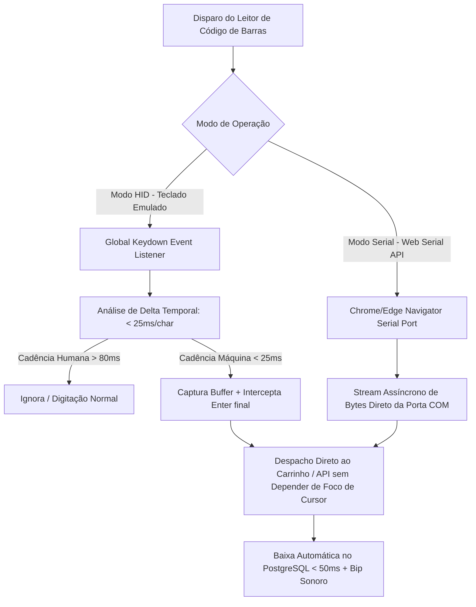

# Proposta Técnica e Comercial
## Sistema Web Integrado de Gestão de Estoque, PDV e Finanças – Auto Elétrica Eletrocar

---

## 1. Sumário Executivo

A presente proposta estabelece os termos técnicos e comerciais para o desenvolvimento e implantação de uma solução web de alta performance voltada à gestão operacional, controle rigoroso de estoque e consolidação financeira para a **Auto Elétrica Eletrocar**.

### 1.1. Diagnóstico do Cenário Atual
* **Perdas de Estoque e Divergências de Inventário**: Falta de rastreabilidade na movimentação de componentes elétricos de alto giro e valor agregado (alternadores, motores de partida, chicotes, baterias, relés, lâmpadas).
* **Gargalo no Atendimento de Balcão**: Processos manuais de busca e baixa de peças, gerando filas, erros de digitação e lentidão no atendimento.
* **Opacidade Financeira**: Ausência de conciliação automática do fluxo de caixa diário e de Demonstração do Resultado do Exercício (DRE) gerencial em tempo real, dificultando a tomada de decisão estratégica e o controle de margem de lucro por serviço/peça.

### 1.2. Impacto da Solução Proposta
* **Baixa Instantânea no Ponto de Venda**: Leitura contínua e sem foco obrigatório via leitor de código de barras (USB/Bluetooth), reduzindo o ciclo de venda para menos de 10 segundos e no máximo 3 toques/leituras.
* **Eliminação de Extravios**: Rastreabilidade transacional de cada item de estoque vinculada a Ordens de Serviço (OS), vendas de balcão e notas de entrada.
* **Visibilidade Financeira 360°**: DRE gerencial automatizado, apuração de CMV (Custo de Mercadoria Vendida), fluxo de caixa diário com fechamento cego e conciliação por método de pagamento (PIX, Cartão, Dinheiro e Faturado).

---

## 2. Escopo Técnico e Arquitetura de Integração

### 2.1. Pilha Tecnológica Selecionada

```
┌────────────────────────────────────────────────────────────────────────┐
│                          CAMADA CLIENTE (SPA)                          │
│   React 18 + TypeScript + TailwindCSS + Web Serial API / Event Wedge   │
└───────────────────────────────────┬────────────────────────────────────┘
                                    │ HTTPS / WSS (JSON REST + WebSocket)
┌───────────────────────────────────▼────────────────────────────────────┐
│                        CAMADA DE APLICAÇÃO                             │
│   Python 3.12 (FastAPI) + Pydantic v2 + SQLAlchemy 2.0 (Async)        │
└───────────────────────────────────┬────────────────────────────────────┘
                                    │ Conexão Pool Assíncrona
┌───────────────────────────────────▼────────────────────────────────────┐
│                        CAMADA DE PERSISTÊNCIA                          │
│   PostgreSQL 16 (Índices B-Tree/GIN + Transações ACID Rigorosas)       │
└────────────────────────────────────────────────────────────────────────┘
```

| Camada | Tecnologia Adotada | Justificativa de Engenharia |
| :--- | :--- | :--- |
| **Backend** | **Python (FastAPI) + AsyncIO** | Execução assíncrona de altíssimo desempenho, validação de esquemas via Pydantic v2 com zero overhead de serialização e geração automática de documentação OpenAPI. |
| **Frontend** | **React + TypeScript + TailwindCSS** | Interface orientada a componentes tipados, renderização veloz sem gargalos de DOM e design system responsivo otimizado para telas de balcão. |
| **Banco de Dados** | **PostgreSQL 16** | Confiabilidade relacional ACID estrita para operações financeiras e de estoque, com índices otimizados (`B-Tree` em SKUs/EANs e `GIN/Trigram` para busca textual ultrarrápida). |
| **Autenticação** | **OAuth2 com JWT + Passlib (Bcrypt)** | Controle de sessão stateless, expiração configurável, tokens seguros e RBAC granular (Balconista vs. Administrador). |

---

### 2.2. Arquitetura de Integração com Leitor de Código de Barras

Para atender ao requisito crítico de **operação contínua no balcão sem perda de foco**, a aplicação implementa duas abordagens complementares de I/O de hardware:



#### Detalhamento dos Mecanismos de Leitura:
1. **Modo HID com Captura Global de Eventos (`Keyboard Wedge`)**:
   - Um *listener* global intercepta eventos `keydown` no objeto `window`.
   - **Diferenciação Algorítmica**: Leitores ópticos disparam sequências de caracteres com intervalo entre 5ms e 25ms, enquanto a digitação humana possui cadência superior a 80ms.
   - O sufixo terminador (`CR`/Enter) é neutralizado via `e.preventDefault()`, impedindo submissões acidentais de formulários e direcionando o código capturado diretamente para o *dispatch* do PDV.
2. **Modo Web Serial API (Comunicação Direta via Porta Serial Virtual)**:
   - Para leitores configurados em modo CDC/Virtual COM (USB ou Bluetooth SPP), a aplicação estabelece um canal serial direto via `navigator.serial`.
   - Garante isolamento absoluto de qualquer elemento de foco da interface gráfica, permitindo leitura em segundo plano com 100% de confiabilidade.

---

## 3. Módulos do Sistema

| Módulo | Funcionalidade Principal | Requisito Crítico Atendido |
| :--- | :--- | :--- |
| **Autenticação e Controle de Acesso (RBAC)** | Login seguro com diferenciação estrita de perfis (Balconista, Mecânico, Administrador/Financeiro) e bloqueio rápido de terminal (*Lock Screen*). | Prevenção de acessos indevidos a dados fiscais e restrição de descontos sem autorização gerencial. |
| **Gestão de Estoque & Baixa Contínua** | Cadastro de peças com múltiplos identificadores (EAN-13, SKU interno, código original Bosch/Marelli) e baixa em tempo real. | Baixa de peças no balcão em menos de 2 segundos com no máximo 3 toques/leituras. |
| **PDV & Balcão Rápido** | Venda ágil de balcão com atalhos de teclado (`F1` a `F9`), busca preditiva por aplicação do veículo e cálculo dinâmico de troco. | Conclusão de atendimento em menos de 10 segundos sem uso obrigatório de mouse. |
| **Ordens de Serviço (OS) & Telegram Voice Bot** | Abertura de OS via terminal web ou por comando de voz no Telegram com transcrição ASR e extração de entidades (Cliente, Carro, Sintomas). | Abertura de OS pelo mecânico na baia de serviço em 15 segundos sem contato com computadores. |
| **Cadastro Simplificado de Clientes** | Cadastro ágil focado em dados operacionais essenciais: Nome do cliente, CPF/CNPJ (opcional) e Carro(s) vinculado(s). | Cadastro de novos clientes durante o atendimento em menos de 15 segundos. |
| **Fluxo de Caixa Diário & Conciliação** | Controle de abertura, sangrias, reforços, fechamento cego de caixa e conciliação por método de pagamento (PIX, Cartão, Dinheiro). | Eliminação total de divergências de caixa e conferência cega auditada. |
| **DRE Gerencial & Relatórios Financeiros** | Apuração automática de Receita Bruta, Deduções, CMV, Lucro Bruto, Custos Operacionais e Lucro Líquido por período e por serviço. | Visibilidade financeira em tempo real com margem líquida consolidada em 1 clique. |
| **Auditoria e Logs Imutáveis** | Registro imutável de todas as exclusões de itens, estornos de vendas, descontos concedidos e alterações manuais de estoque. | Rastreabilidade total e conformidade com padrões de governança e prevenção a perdas. |

---

## 4. Cronograma de Entrega (10 Semanas)

O projeto será executado sob metodologia ágil, dividido em **5 Sprints de 2 semanas**, garantindo entregas incrementais homologadas:

```
Sprint 1 (Sem 01-02) ──► Sprint 2 (Sem 03-04) ──► Sprint 3 (Sem 05-06) ──► Sprint 4 (Sem 07-08) ──► Sprint 5 (Sem 09-10)
  [Setup & Auth]          [Estoque & HW]          [PDV, OS & Bot]        [Financeiro & DRE]       [Homolog & Go-Live]
```

| Sprint | Período | Entregáveis Técnicos e Operacionais |
| :---: | :---: | :--- |
| **Sprint 1** | **Semanas 01 e 02** | • Modelagem do banco de dados PostgreSQL com índices otimizados.<br>• Implementação da API base em FastAPI (estruturação de rotas, middleware de auditoria e autenticação JWT).<br>• Módulo de Usuários e tela de login com perfilamento RBAC. |
| **Sprint 2** | **Semanas 03 e 04** | • Módulo de Cadastro e Gestão de Estoque (SKU, EAN-13, estoque mínimo).<br>• Integração com Leitor de Código de Barras (modo HID global + Web Serial API).<br>• Testes de latência de leitura e controle de concorrência na baixa de estoque. |
| **Sprint 3** | **Semanas 05 e 06** | • Interface do Balcão / PDV Rápido com navegação 100% por teclado.<br>• Módulo de Ordens de Serviço (OS) com emissão de comprovantes.<br>• Integração do Telegram Voice Bot para criação automatizada de OS via áudio. |
| **Sprint 4** | **Semanas 07 e 08** | • Módulo Financeiro completo: Abertura e Fechamento Cego de Caixa, Sangrias e Suprimentos.<br>• Motor de conciliação multi-meios (PIX com QR Code dinâmico, Cartões e Boletos).<br>• Relatório DRE Gerencial automático e cálculo de CMV em tempo real. |
| **Sprint 5** | **Semanas 09 e 10** | • Testes de carga, estresse transacional e simulação de perda de conexão (PWA/Offline).<br>• Treinamento operacional dos balconistas, mecânicos e administradores.<br>• Entrada em produção (*Go-Live*), migração de dados e monitoramento assistido. |

---

## 5. Investimento e Condições Comerciais

### 5.1. Estrutura de Investimento

```
┌─────────────────────────────────────────────────────────────────────────┐
│                          PROPOSTA COMERCIAL                             │
├────────────────────────────────────────┬────────────────────────────────┤
│ Desenvolvimento & Implantação (Setup)  │ R$ 14.800,00 (em 4 parcelas)   │
├────────────────────────────────────────┼────────────────────────────────┤
│ Infraestrutura Cloud & Manutenção      │ R$ 180,00 / mês                │
├────────────────────────────────────────┼────────────────────────────────┤
│ Consumo de APIs (Whisper / IA Voz)     │ ~R$ 25,00 a R$ 40,00 / mês     │
└────────────────────────────────────────┴────────────────────────────────┘
```

| Item | Descrição do Escopo | Valor (R$) |
| :--- | :--- | :--- |
| **Desenvolvimento e Customização** | Engenharia de software completa (FastAPI + React), integração de hardware (leitores de código de barras), bot do Telegram, PDV, DRE e estoque. | **R$ 14.800,00** |
| **Instalação, Homologação e Treinamento** | Configuração do servidor em produção, homologação dos terminais de balcão e capacitação prática da equipe da oficina. | *Incluso no pacote* |
| **Hospedagem em Nuvem, Backup & Monitoramento** | Servidor VPS Linux de alta disponibilidade, banco de dados gerenciado PostgreSQL, certificado SSL e rotina diária de backups automatizados. | **R$ 180,00 / mês** |
| **Suporte Técnico Nível 2 e Manutenção Preventiva** | Atendimento prioritário para incidentes, correções de bugs, atualizações de segurança e monitoramento de uptime (SLA 99.5%). | **R$ 350,00 / mês** *(opcional após período de garantia de 90 dias)* |

### 5.2. Condições de Pagamento
* **Entrada (25%)**: No ato da assinatura do contrato e início do Sprint 1 (R$ 3.700,00).
* **2ª Parcela (25%)**: Na conclusão e validação do Sprint 2 – Módulo de Estoque e Hardware (R$ 3.700,00).
* **3ª Parcela (25%)**: Na conclusão do Sprint 4 – Módulos Financeiro e DRE (R$ 3.700,00).
* **4ª Parcela (25%)**: No Go-Live e homologação final do Sprint 5 (R$ 3.700,00).

### 5.3. Garantia e Nível de Serviço (SLA)
* **Garantia Técnica Total**: 90 (noventa) dias corridos após o *Go-Live*, cobrindo qualquer ajuste ou correção de inconformidades sem custo adicional.
* **Propriedade Intelectual e Código-Fonte**: O código-fonte completo, scripts de banco de dados e documentação técnica serão de propriedade exclusiva do cliente.

---

*Proposta válida por 15 (quinze) dias a contar da data de emissão.*
