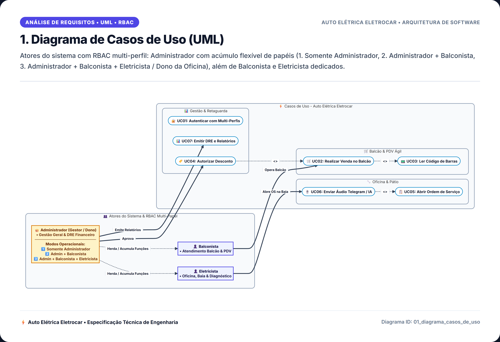
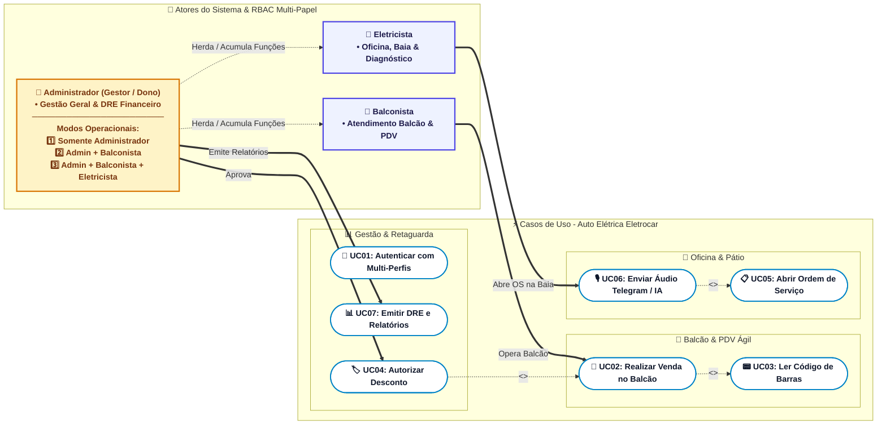

# 1. Diagrama de Casos de Uso (UML)

> **Categoria**: Análise de Requisitos • UML • RBAC  
> **Sistema**: Auto Elétrica Eletrocar  
> **Arquivo Fonte**: [`01_diagrama_casos_de_uso.mmd`](./src/01_diagrama_casos_de_uso.mmd)

---

## 📌 Descrição e Contexto para Apresentação

Atores do sistema com RBAC multi-perfil: Administrador com acúmulo flexível de papéis (1. Somente Administrador, 2. Administrador + Balconista, 3. Administrador + Balconista + Eletricista / Dono da Oficina), além de Balconista e Eletricista dedicados.

---

## 🖼️ Foto / Slide em Alta Resolução (4K Ultra-HD)

> 💡 *Dica de Apresentação: Você também pode usar o arquivo vetorial editável em [SVG](./img/01_diagrama_casos_de_uso.svg) ou inserir o PNG direto no PowerPoint / Google Slides.*

---

## 💻 Código Fonte Mermaid

---

*Documentação oficial e slides de engenharia da Auto Elétrica Eletrocar.*
