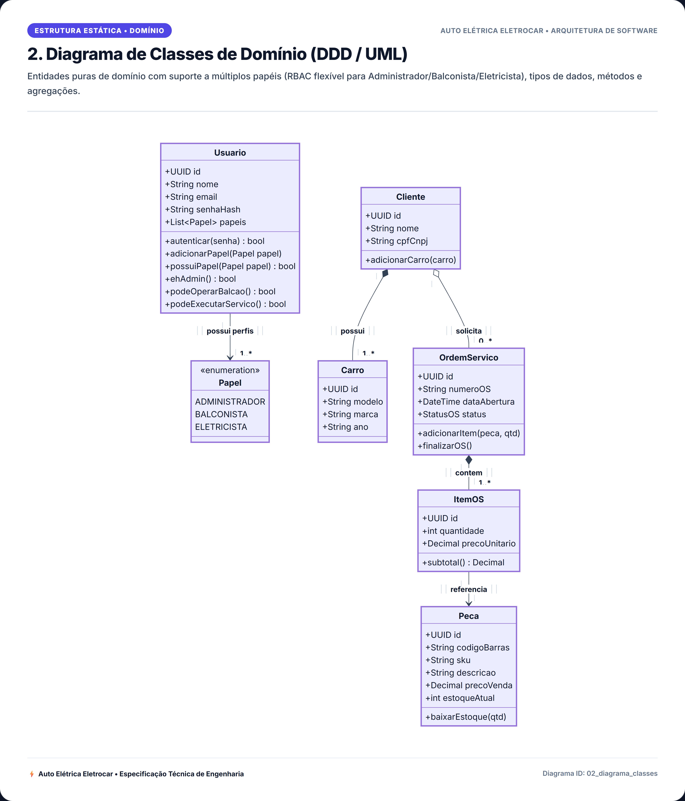
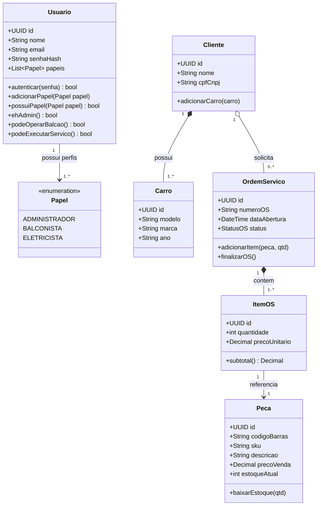

# 2. Diagrama de Classes de Domínio (DDD / UML)

> **Categoria**: Estrutura Estática • Domínio  
> **Sistema**: Auto Elétrica Eletrocar  
> **Arquivo Fonte**: [`02_diagrama_classes.mmd`](./src/02_diagrama_classes.mmd)

---

## 📌 Descrição e Contexto para Apresentação

Entidades puras de domínio com suporte a múltiplos papéis (RBAC flexível para Administrador/Balconista/Eletricista), tipos de dados, métodos e agregações.

---

## 🖼️ Foto / Slide em Alta Resolução (4K Ultra-HD)

> 💡 *Dica de Apresentação: Você também pode usar o arquivo vetorial editável em [SVG](./img/02_diagrama_classes.svg) ou inserir o PNG direto no PowerPoint / Google Slides.*

---

## 💻 Código Fonte Mermaid

---

*Documentação oficial e slides de engenharia da Auto Elétrica Eletrocar.*
