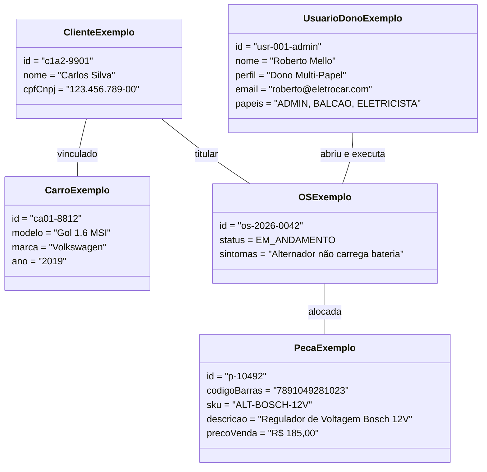

# 4. Diagrama de Objetos (Runtime Snapshot)

> **Categoria**: Instâncias em Tempo de Execução • UML  
> **Sistema**: Auto Elétrica Eletrocar  
> **Arquivo Fonte**: [`04_diagrama_objetos.mmd`](./src/04_diagrama_objetos.mmd)

---

## 📌 Descrição e Contexto para Apresentação

Instantâneo concreto de objetos em memória: instâncias ativas de Usuário Multi-Papel (Admin+Balconista+Eletricista), Cliente, Veículo, OS em andamento e Peça Bosch alocada.

---

## 🖼️ Foto / Slide em Alta Resolução (4K Ultra-HD)

> 💡 *Dica de Apresentação: Você também pode usar o arquivo vetorial editável em [SVG](./img/04_diagrama_objetos.svg) ou inserir o PNG direto no PowerPoint / Google Slides.*

---

## 💻 Código Fonte Mermaid

---

*Documentação oficial e slides de engenharia da Auto Elétrica Eletrocar.*
