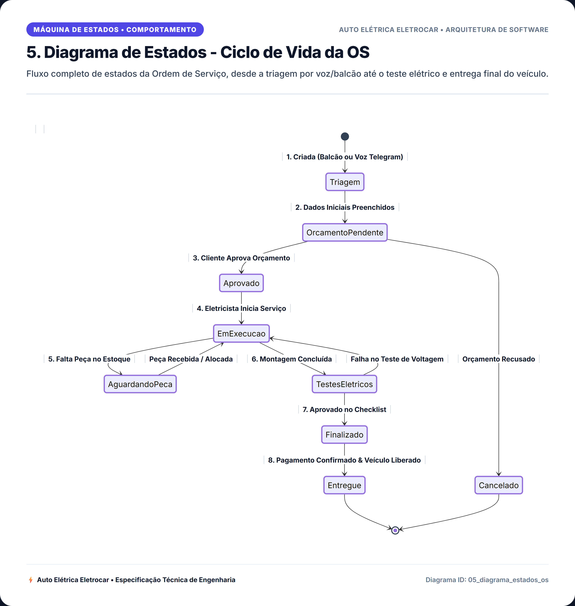
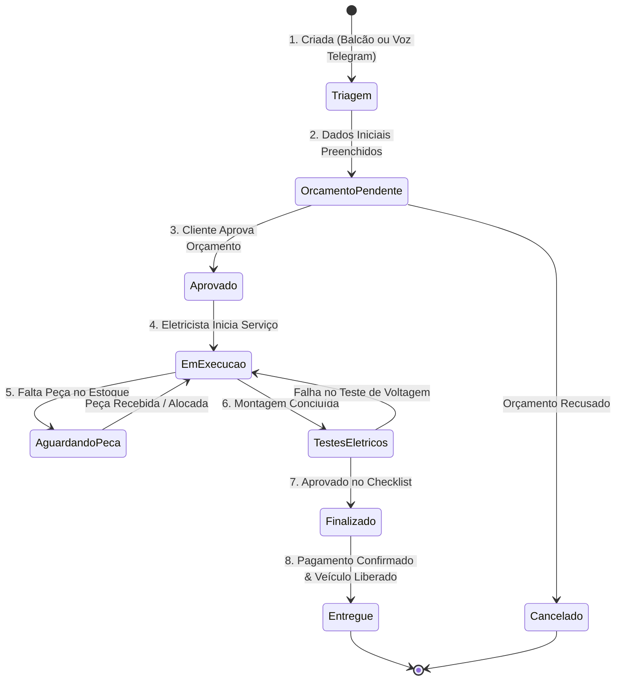

# 5. Diagrama de Estados - Ciclo de Vida da OS

> **Categoria**: Máquina de Estados • Comportamento  
> **Sistema**: Auto Elétrica Eletrocar  
> **Arquivo Fonte**: [`05_diagrama_estados_os.mmd`](./src/05_diagrama_estados_os.mmd)

---

## 📌 Descrição e Contexto para Apresentação

Fluxo completo de estados da Ordem de Serviço, desde a triagem por voz/balcão até o teste elétrico e entrega final do veículo.

---

## 🖼️ Foto / Slide em Alta Resolução (4K Ultra-HD)

> 💡 *Dica de Apresentação: Você também pode usar o arquivo vetorial editável em [SVG](./img/05_diagrama_estados_os.svg) ou inserir o PNG direto no PowerPoint / Google Slides.*

---

## 💻 Código Fonte Mermaid

---

*Documentação oficial e slides de engenharia da Auto Elétrica Eletrocar.*
