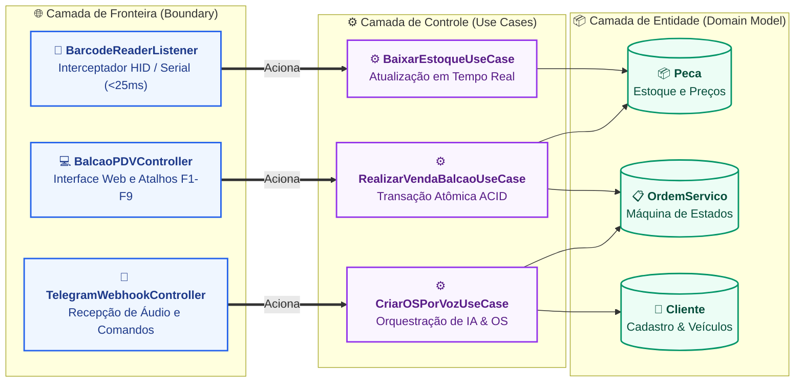

# 6. Diagrama Boundary-Control-Entity (BCE)

> **Categoria**: Padrão Arquitetural • Design Robusto  
> **Sistema**: Auto Elétrica Eletrocar  
> **Arquivo Fonte**: [`06_diagrama_bce.mmd`](./src/06_diagrama_bce.mmd)

---

## 📌 Descrição e Contexto para Apresentação

Separação estrutural de responsabilidades entre Interfaces/Fronteira (Boundary), Casos de Uso/Orquestração (Control) e Entidades de Domínio (Entity).

---

## 🖼️ Foto / Slide em Alta Resolução (4K Ultra-HD)

> 💡 *Dica de Apresentação: Você também pode usar o arquivo vetorial editável em [SVG](./img/06_diagrama_bce.svg) ou inserir o PNG direto no PowerPoint / Google Slides.*

---

## 💻 Código Fonte Mermaid

---

*Documentação oficial e slides de engenharia da Auto Elétrica Eletrocar.*
