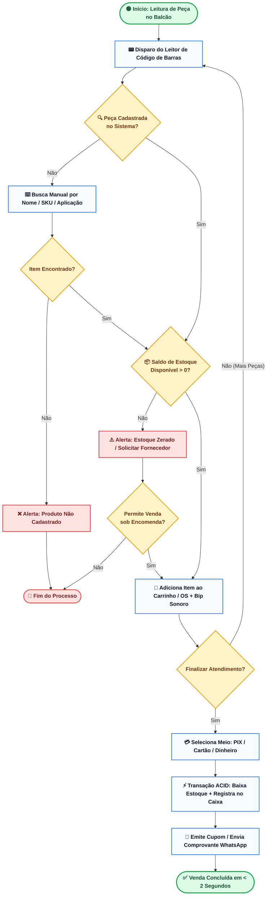

# 8. Diagrama de Atividades - Operação de Balcão e PDV

> **Categoria**: Processo Operacional • PDV Ágil  
> **Sistema**: Auto Elétrica Eletrocar  
> **Arquivo Fonte**: [`08_diagrama_atividades_balcao.mmd`](./src/08_diagrama_atividades_balcao.mmd)

---

## 📌 Descrição e Contexto para Apresentação

Fluxo de decisão do balconista: leitura óptica, busca alternativa, validação de saldo, venda sob encomenda e baixa atômica de estoque.

---

## 🖼️ Foto / Slide em Alta Resolução (4K Ultra-HD)

> 💡 *Dica de Apresentação: Você também pode usar o arquivo vetorial editável em [SVG](./img/08_diagrama_atividades_balcao.svg) ou inserir o PNG direto no PowerPoint / Google Slides.*

---

## 💻 Código Fonte Mermaid

---

*Documentação oficial e slides de engenharia da Auto Elétrica Eletrocar.*
