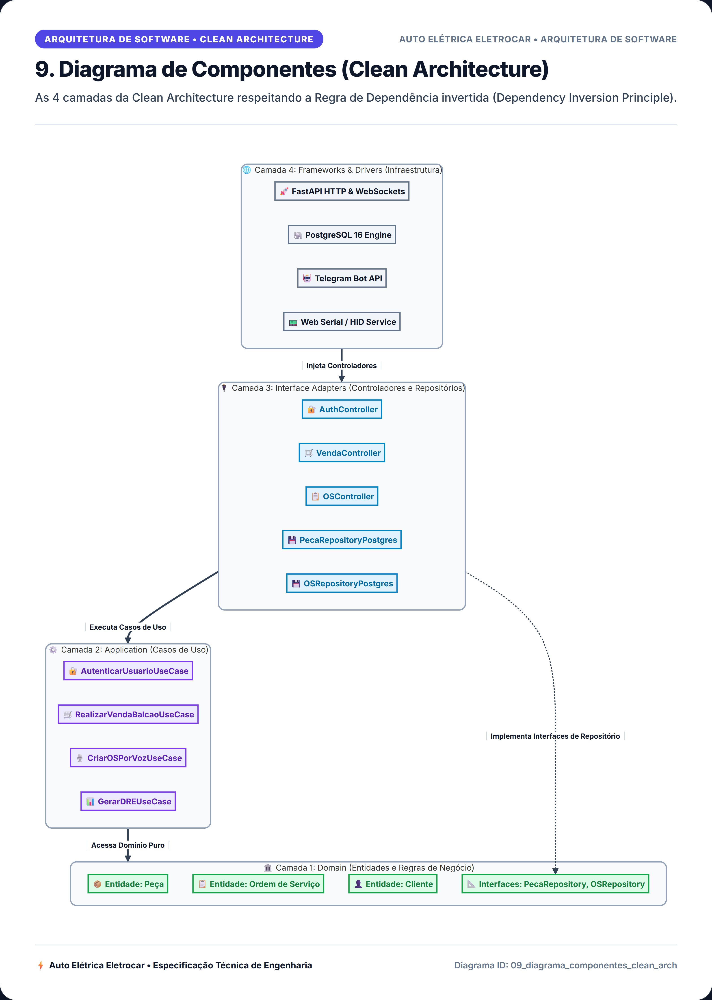
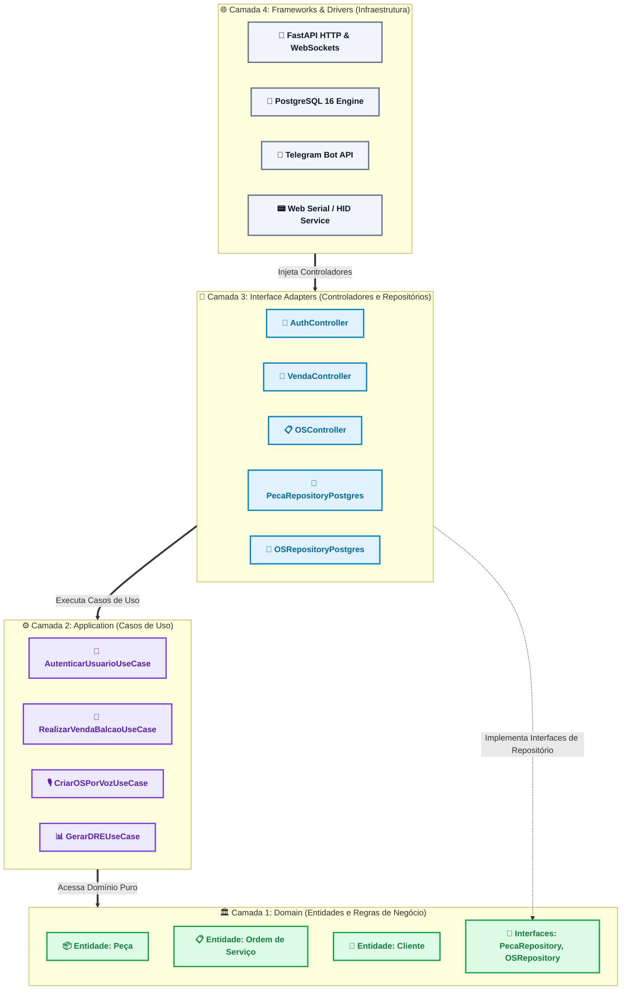

# 9. Diagrama de Componentes (Clean Architecture)

> **Categoria**: Arquitetura de Software • Clean Architecture  
> **Sistema**: Auto Elétrica Eletrocar  
> **Arquivo Fonte**: [`09_diagrama_componentes_clean_arch.mmd`](./src/09_diagrama_componentes_clean_arch.mmd)

---

## 📌 Descrição e Contexto para Apresentação

As 4 camadas da Clean Architecture respeitando a Regra de Dependência invertida (Dependency Inversion Principle).

---

## 🖼️ Foto / Slide em Alta Resolução (4K Ultra-HD)

> 💡 *Dica de Apresentação: Você também pode usar o arquivo vetorial editável em [SVG](./img/09_diagrama_componentes_clean_arch.svg) ou inserir o PNG direto no PowerPoint / Google Slides.*

---

## 💻 Código Fonte Mermaid

---

*Documentação oficial e slides de engenharia da Auto Elétrica Eletrocar.*
