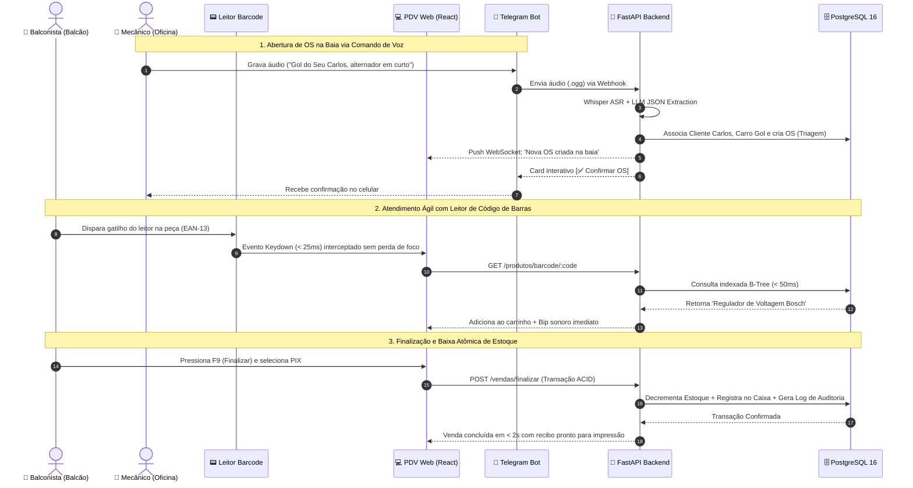

# 11. Sequência Operacional Balcão e Oficina (Ponta a Ponta)

> **Categoria**: Fluxos Integrados • Operação Diária  
> **Sistema**: Auto Elétrica Eletrocar  
> **Arquivo Fonte**: [`11_diagrama_sequencia_fluxo_operacional.mmd`](./src/11_diagrama_sequencia_fluxo_operacional.mmd)

---

## 📌 Descrição e Contexto para Apresentação

Visão cronológica dos 3 processos simultâneos: 1. Abertura de OS por voz na oficina, 2. Leitura e consulta rápida no balcão, 3. Fechamento de venda com baixa atômica.

---

## 🖼️ Foto / Slide em Alta Resolução (4K Ultra-HD)

> 💡 *Dica de Apresentação: Você também pode usar o arquivo vetorial editável em [SVG](./img/11_diagrama_sequencia_fluxo_operacional.svg) ou inserir o PNG direto no PowerPoint / Google Slides.*

---

## 💻 Código Fonte Mermaid

---

*Documentação oficial e slides de engenharia da Auto Elétrica Eletrocar.*
