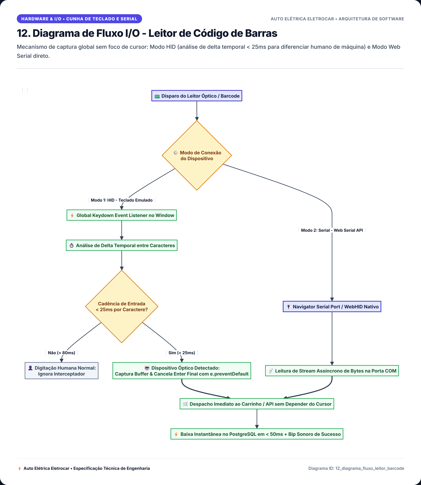
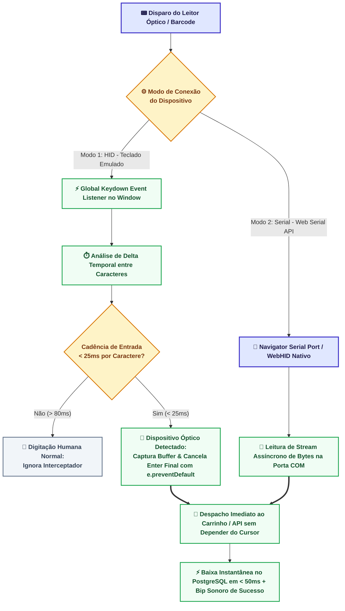

# 12. Diagrama de Fluxo I/O - Leitor de Código de Barras

> **Categoria**: Hardware & I/O • Cunha de Teclado e Serial  
> **Sistema**: Auto Elétrica Eletrocar  
> **Arquivo Fonte**: [`12_diagrama_fluxo_leitor_barcode.mmd`](./src/12_diagrama_fluxo_leitor_barcode.mmd)

---

## 📌 Descrição e Contexto para Apresentação

Mecanismo de captura global sem foco de cursor: Modo HID (análise de delta temporal < 25ms para diferenciar humano de máquina) e Modo Web Serial direto.

---

## 🖼️ Foto / Slide em Alta Resolução (4K Ultra-HD)

> 💡 *Dica de Apresentação: Você também pode usar o arquivo vetorial editável em [SVG](./img/12_diagrama_fluxo_leitor_barcode.svg) ou inserir o PNG direto no PowerPoint / Google Slides.*

---

## 💻 Código Fonte Mermaid

---

*Documentação oficial e slides de engenharia da Auto Elétrica Eletrocar.*
