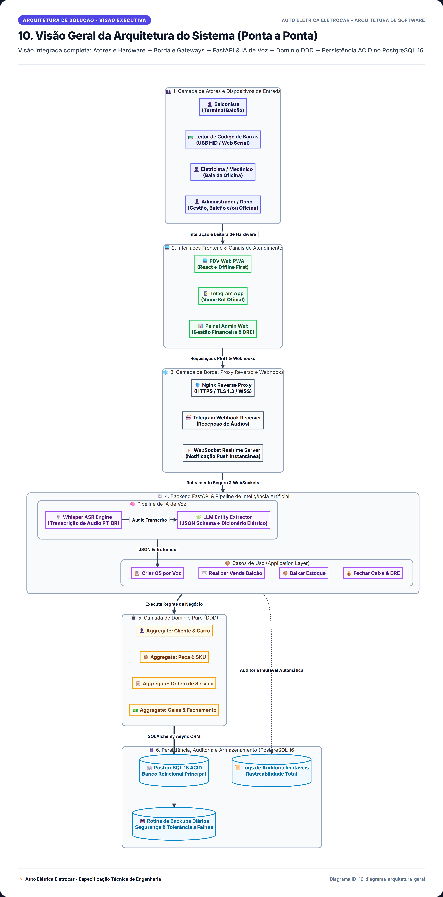

# 📐 Catálogo de Diagramas de Arquitetura e Engenharia (Slides de Apresentação)
## Auto Elétrica Eletrocar

Este diretório contém a separação individual de cada diagrama de software, arquitetura e fluxo operacional do sistema da **Auto Elétrica Eletrocar**, renderizados em **alta definição (4K Ultra-HD)** e otimizados para **slides de apresentação, relatórios executivos e projetores**.

---

## 📑 Sumário de Diagramas para Apresentação

| # | Diagrama | Categoria | Documento | Slide PNG (4K) | Vetor SVG |
| :-: | :--- | :--- | :--- | :--- | :--- |
| **01** | [Diagrama de Casos de Uso (UML)](./01_diagrama_casos_de_uso.md) | `Análise de Requisitos • UML • RBAC` | [`01_diagrama_casos_de_uso.md`](./01_diagrama_casos_de_uso.md) | [🖼️ Ver Foto PNG](./img/01_diagrama_casos_de_uso.png) | [📐 Vetor SVG](./img/01_diagrama_casos_de_uso.svg) |
| **02** | [Diagrama de Classes de Domínio (DDD / UML)](./02_diagrama_classes.md) | `Estrutura Estática • Domínio` | [`02_diagrama_classes.md`](./02_diagrama_classes.md) | [🖼️ Ver Foto PNG](./img/02_diagrama_classes.png) | [📐 Vetor SVG](./img/02_diagrama_classes.svg) |
| **03** | [Diagrama Entidade-Relacionamento (DER Relacional)](./03_diagrama_der.md) | `Banco de Dados • PostgreSQL 16` | [`03_diagrama_der.md`](./03_diagrama_der.md) | [🖼️ Ver Foto PNG](./img/03_diagrama_der.png) | [📐 Vetor SVG](./img/03_diagrama_der.svg) |
| **04** | [Diagrama de Objetos (Runtime Snapshot)](./04_diagrama_objetos.md) | `Instâncias em Tempo de Execução • UML` | [`04_diagrama_objetos.md`](./04_diagrama_objetos.md) | [🖼️ Ver Foto PNG](./img/04_diagrama_objetos.png) | [📐 Vetor SVG](./img/04_diagrama_objetos.svg) |
| **05** | [Diagrama de Estados - Ciclo de Vida da OS](./05_diagrama_estados_os.md) | `Máquina de Estados • Comportamento` | [`05_diagrama_estados_os.md`](./05_diagrama_estados_os.md) | [🖼️ Ver Foto PNG](./img/05_diagrama_estados_os.png) | [📐 Vetor SVG](./img/05_diagrama_estados_os.svg) |
| **06** | [Diagrama Boundary-Control-Entity (BCE)](./06_diagrama_bce.md) | `Padrão Arquitetural • Design Robusto` | [`06_diagrama_bce.md`](./06_diagrama_bce.md) | [🖼️ Ver Foto PNG](./img/06_diagrama_bce.png) | [📐 Vetor SVG](./img/06_diagrama_bce.svg) |
| **07** | [Diagrama de Sequência - Pipeline de IA por Voz](./07_diagrama_sequencia_voz.md) | `Inteligência Artificial • Automação por Áudio` | [`07_diagrama_sequencia_voz.md`](./07_diagrama_sequencia_voz.md) | [🖼️ Ver Foto PNG](./img/07_diagrama_sequencia_voz.png) | [📐 Vetor SVG](./img/07_diagrama_sequencia_voz.svg) |
| **08** | [Diagrama de Atividades - Operação de Balcão e PDV](./08_diagrama_atividades_balcao.md) | `Processo Operacional • PDV Ágil` | [`08_diagrama_atividades_balcao.md`](./08_diagrama_atividades_balcao.md) | [🖼️ Ver Foto PNG](./img/08_diagrama_atividades_balcao.png) | [📐 Vetor SVG](./img/08_diagrama_atividades_balcao.svg) |
| **09** | [Diagrama de Componentes (Clean Architecture)](./09_diagrama_componentes_clean_arch.md) | `Arquitetura de Software • Clean Architecture` | [`09_diagrama_componentes_clean_arch.md`](./09_diagrama_componentes_clean_arch.md) | [🖼️ Ver Foto PNG](./img/09_diagrama_componentes_clean_arch.png) | [📐 Vetor SVG](./img/09_diagrama_componentes_clean_arch.svg) |
| **10** | [Visão Geral da Arquitetura do Sistema (Ponta a Ponta)](./10_diagrama_arquitetura_geral.md) | `Arquitetura de Solução • Visão Executiva` | [`10_diagrama_arquitetura_geral.md`](./10_diagrama_arquitetura_geral.md) | [🖼️ Ver Foto PNG](./img/10_diagrama_arquitetura_geral.png) | [📐 Vetor SVG](./img/10_diagrama_arquitetura_geral.svg) |
| **11** | [Sequência Operacional Balcão e Oficina (Ponta a Ponta)](./11_diagrama_sequencia_fluxo_operacional.md) | `Fluxos Integrados • Operação Diária` | [`11_diagrama_sequencia_fluxo_operacional.md`](./11_diagrama_sequencia_fluxo_operacional.md) | [🖼️ Ver Foto PNG](./img/11_diagrama_sequencia_fluxo_operacional.png) | [📐 Vetor SVG](./img/11_diagrama_sequencia_fluxo_operacional.svg) |
| **12** | [Diagrama de Fluxo I/O - Leitor de Código de Barras](./12_diagrama_fluxo_leitor_barcode.md) | `Hardware & I/O • Cunha de Teclado e Serial` | [`12_diagrama_fluxo_leitor_barcode.md`](./12_diagrama_fluxo_leitor_barcode.md) | [🖼️ Ver Foto PNG](./img/12_diagrama_fluxo_leitor_barcode.png) | [📐 Vetor SVG](./img/12_diagrama_fluxo_leitor_barcode.svg) |

---

## 🖼️ Galeria Visual dos Slides de Apresentação

### 📌 [1. Diagrama de Casos de Uso (UML)](./01_diagrama_casos_de_uso.md)

> **Categoria**: `Análise de Requisitos • UML • RBAC`  
> Atores do sistema com RBAC multi-perfil: Administrador com acúmulo flexível de papéis (1. Somente Administrador, 2. Administrador + Balconista, 3. Administrador + Balconista + Eletricista / Dono da Oficina), além de Balconista e Eletricista dedicados.

---

### 📌 [2. Diagrama de Classes de Domínio (DDD / UML)](./02_diagrama_classes.md)

> **Categoria**: `Estrutura Estática • Domínio`  
> Entidades puras de domínio com suporte a múltiplos papéis (RBAC flexível para Administrador/Balconista/Eletricista), tipos de dados, métodos e agregações.

---

### 📌 [3. Diagrama Entidade-Relacionamento (DER Relacional)](./03_diagrama_der.md)

> **Categoria**: `Banco de Dados • PostgreSQL 16`  
> Esquema relacional no PostgreSQL 16 com suporte a RBAC multi-perfil (tabela associativa USUARIOS_PAPEIS N:N), integridade referencial e chaves estrangeiras.

---

### 📌 [4. Diagrama de Objetos (Runtime Snapshot)](./04_diagrama_objetos.md)

> **Categoria**: `Instâncias em Tempo de Execução • UML`  
> Instantâneo concreto de objetos em memória: instâncias ativas de Usuário Multi-Papel (Admin+Balconista+Eletricista), Cliente, Veículo, OS em andamento e Peça Bosch alocada.

---

### 📌 [5. Diagrama de Estados - Ciclo de Vida da OS](./05_diagrama_estados_os.md)

> **Categoria**: `Máquina de Estados • Comportamento`  
> Fluxo completo de estados da Ordem de Serviço, desde a triagem por voz/balcão até o teste elétrico e entrega final do veículo.

---

### 📌 [6. Diagrama Boundary-Control-Entity (BCE)](./06_diagrama_bce.md)

> **Categoria**: `Padrão Arquitetural • Design Robusto`  
> Separação estrutural de responsabilidades entre Interfaces/Fronteira (Boundary), Casos de Uso/Orquestração (Control) e Entidades de Domínio (Entity).

---

### 📌 [7. Diagrama de Sequência - Pipeline de IA por Voz](./07_diagrama_sequencia_voz.md)

> **Categoria**: `Inteligência Artificial • Automação por Áudio`  
> Fluxo síncrono/assíncrono da abertura de OS: Gravação no Telegram → Whisper ASR → LLM JSON Extraction → Persistência e WebSocket em tempo real.

---

### 📌 [8. Diagrama de Atividades - Operação de Balcão e PDV](./08_diagrama_atividades_balcao.md)

> **Categoria**: `Processo Operacional • PDV Ágil`  
> Fluxo de decisão do balconista: leitura óptica, busca alternativa, validação de saldo, venda sob encomenda e baixa atômica de estoque.

---

### 📌 [9. Diagrama de Componentes (Clean Architecture)](./09_diagrama_componentes_clean_arch.md)

> **Categoria**: `Arquitetura de Software • Clean Architecture`  
> As 4 camadas da Clean Architecture respeitando a Regra de Dependência invertida (Dependency Inversion Principle).

---

### 📌 [10. Visão Geral da Arquitetura do Sistema (Ponta a Ponta)](./10_diagrama_arquitetura_geral.md)

> **Categoria**: `Arquitetura de Solução • Visão Executiva`  
> Visão integrada completa: Atores e Hardware → Borda e Gateways → FastAPI & IA de Voz → Domínio DDD → Persistência ACID no PostgreSQL 16.

---

### 📌 [11. Sequência Operacional Balcão e Oficina (Ponta a Ponta)](./11_diagrama_sequencia_fluxo_operacional.md)

> **Categoria**: `Fluxos Integrados • Operação Diária`  
> Visão cronológica dos 3 processos simultâneos: 1. Abertura de OS por voz na oficina, 2. Leitura e consulta rápida no balcão, 3. Fechamento de venda com baixa atômica.

---

### 📌 [12. Diagrama de Fluxo I/O - Leitor de Código de Barras](./12_diagrama_fluxo_leitor_barcode.md)

> **Categoria**: `Hardware & I/O • Cunha de Teclado e Serial`  
> Mecanismo de captura global sem foco de cursor: Modo HID (análise de delta temporal < 25ms para diferenciar humano de máquina) e Modo Web Serial direto.

---

*Documentação gerada com design de apresentação para a Auto Elétrica Eletrocar.*
